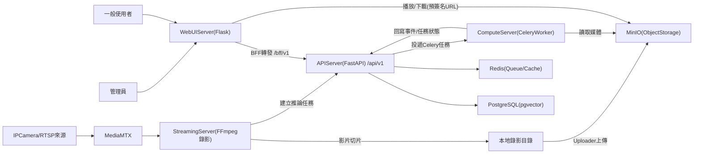

## 2. 系統概述

### 2.0 本章目的說明
本章旨在讓讀者在不閱讀原始碼的前提下，理解「回憶拾光」的背景、目標、範圍、角色、執行環境與主要限制，並建立後續架構與功能設計章節所需的共同語境。

### 2.0 本章涵蓋範圍
- **系統背景與問題描述**：本專案要解決的使用情境與痛點
- **系統目標**：一般使用者與管理員的可驗證目標
- **系統範圍**：包含/不包含項目（以 Demo 可落地為準）
- **使用者角色與利害關係人**：誰會使用、維護、或受影響
- **系統功能概述**：高階功能分類（不進入設計細節）
- **系統執行環境**：軟硬體、部署方式、網路入口
- **主要設計考量與限制**：可驗證的限制與取捨

### 2.1 系統背景與問題描述
回憶拾光是一套以「AI 自動紀錄生活片段並生成個人化日誌與短影片」為核心的智慧系統，目標讓使用者無需手持手機，即可自動捕捉日常畫面；AI 會協助偵測事件、生成日記摘要、剪出精華短片，並支援自然語言查詢。

本專案的開發範圍聚焦於「個人化應用、單鏡頭來源、架構可行性」，不涉醫療或監控用途，並以開源技術（FastAPI、Celery、MinIO、PostgreSQL）構建；專案最終目標是完成一套可執行之系統，於 Demo 中展示「影片 → 事件切割 → 日記 → 回憶短片 → 查詢」的完整閉環。

本系統預期可應用於個人生活紀錄與延伸情境，兼具娛樂性與實用性，協助使用者更輕鬆地回顧與分享生活中的珍貴片段。

### 2.2 系統目標
本節將目標拆分為「一般使用者」與「管理員」兩類，作為後續功能設計的驗收準則來源。

#### 2.2.1 一般使用者目標
- **G-USER-01**：使用者希望紀錄生活中的精彩瞬間，但不想手持手機拍攝。
- **G-USER-02**：系統能自動擷取特定片段（如：走路、吃飯、看書），並生成「每日回憶影片」（回憶短片/Vlog）。
- **G-USER-03**：使用者可查看事件時間軸、影片列表，並手動編輯或刪除事件。
- **G-USER-04**：使用者可下載或分享由系統生成的精華影片。
- **G-USER-05**：使用者可使用文字/語音詢問（例如：「我今天做了什麼？」），系統回傳事件摘要與故事敘述。

#### 2.2.2 管理員目標
- **G-ADMIN-01**：負責系統部署、維運與錯誤排除。
- **G-ADMIN-02**：監控伺服器負載、串流狀態與資料使用量，確保系統穩定。

### 2.3 系統範圍
本系統範圍以 `design/spec.md` 的「範圍內/外」作為基礎，並以 Demo 可交付為核心。

| 範圍內（本專案交付） | 範圍外（不在本次交付） |
| --- | --- |
| 單一使用者（個人）生活紀錄與回顧 | 多人共享、社群平台功能 |
| 單鏡頭來源（可模擬 RTSP 串流） | 多攝影機整合與遠端監控 |
| 自動錄影切片、事件偵測與摘要 | 醫療等級行為辨識、臨床診斷 |
| 回憶短片自動生成（含背景音樂） | 長篇影片剪輯、濾鏡特效產品化 |
| Web 端操作介面（登入、瀏覽、查詢、管理） | 手機 App / 穿戴硬體開發 |
| MinIO 媒體管理（影片/縮圖/音樂等） | 醫療資訊安全法規（例如 HIPAA） |

### 2.4 使用者角色與利害關係人
- **一般使用者（User）**：登入後操作 Web UI，查看錄影、事件、日記、回憶短片，並使用自然語言查詢。
- **管理員（Admin）**：透過管理頁面與管理 API 設定系統參數（例如：LLM 預設、影片切片秒數、預設 API Key 限制）、檢視任務與使用者統計。
- **系統維運/部署人員**：負責 Docker 環境、網路入口（Nginx）、儲存（MinIO/DB）與服務健康狀態。
- **外部依賴服務提供者**：LLM 供應商（例如 Google Gemini API）與 GPU/算力資源（ComputeServer）。

### 2.5 系統功能概述（高階分類）
本節僅描述功能分類，不描述每個端點/資料表細節；細節於第 4 章呈現。

- **F-A 影音取得與錄影**：從 RTSP/WebRTC 串流取得來源，FFmpeg 依切片規則產出影片檔。
- **F-B 媒體資產管理**：影片、縮圖、音樂等資產以物件儲存管理，並提供瀏覽器可用的下載/播放連結。
- **F-C 事件偵測與結構化摘要**：對錄影片段進行抽幀、影像描述與 LLM 事件切割，產生事件（時間/場景/動作/摘要）。
- **F-D 日記摘要**：將單日事件彙整為日記內容，並支援自動刷新與（可選）embedding。
- **F-E 回憶短片（Vlog）**：從事件片段剪輯合併成精華短片，可套用背景音樂並生成縮圖。
- **F-F 自然語言查詢/聊天**：使用者以自然語言詢問，系統回傳答案並附帶可回顧的事件/影片/日記/Vlog。
- **F-G 帳號、權限與系統管理**：使用者登入/設定、管理員設定與 API Key 管理、用量限制與黑名單。
- **F-H 任務與系統狀態**：背景任務可追蹤狀態/進度，並可檢視串流與任務列表。

### 2.6 系統執行環境
- **作業系統**：Windows（開發/展示環境），以 Docker Desktop 執行服務。
- **部署方式**：Docker Compose（服務間以同一個 bridge network 溝通）。
- **主要服務組成**（以 `deploy/docker-compose.yml` 為準）：
  - WebUIServer（Flask）：提供頁面與 BFF Proxy。
  - APIServer（FastAPI）：提供 `/api/v1/*` 之 REST API。
  - StreamingServer：管理 FFmpeg 錄影切片與 uploader。
  - ComputeServer（Celery Worker）：事件偵測、回憶短片生成、embedding/RAG 任務。
  - PostgreSQL（含 pgvector）：儲存帳號、事件、任務、日記、回憶短片等結構化資料。
  - Redis：Celery broker/快取（依環境設定）。
  - MinIO：儲存影片/縮圖/音樂等大型媒體檔。
  - MediaMTX：RTSP/WebRTC 串流路由。
  - Nginx：對外入口（HTTP/HTTPS 與 RTSP TCP 代理）。
- **硬體需求**：
  - CPU/RAM：可支援影片處理與資料庫運作（依 Demo 規模調整）。
  - GPU：可選（ComputeServer 影像模型推論可受益）。
- **網路與端口（摘要）**：
  - HTTP/HTTPS：由 Nginx 統一入口。
  - RTSP TCP：由 Nginx 代理（示範用）。
  - WebRTC ICE/UDP：由 MediaMTX 以 UDP 直出（避免 ICE 來源位址不一致）。
  - MinIO API：需直接暴露以支援 presigned URL（避免反向代理重寫破壞簽名）。

### 2.7 主要設計考量與限制
- **隱私與存取控制**：
  - 使用者資料需以帳號與權限隔離；一般使用者不可取得他人錄影/事件。
  - 串流推拉以短效 token 控制（publish/read、audience 區分）。
- **時間一致性**：
  - 系統內部以 UTC 儲存時間戳；對使用者顯示以使用者設定時區轉換。
  - 串流切片與事件時間對齊需避免「來源時間/伺服器時間偏差」造成錯位。
- **可靠性與可恢復性**：
  - 上傳與任務派送採用重試與佇列，避免短暫網路或服務不穩導致資料遺失。
  - 物件儲存（MinIO）與資料庫（PostgreSQL）的一致性需有明確順序與補償策略。
- **成本與用量限制**：
  - LLM 呼叫有配額與費用，需以「預設 API Key 的用量限制」降低風險。
  - 黑名單機制可禁止特定使用者使用預設 key，避免資源被濫用。
- **效能與延遲**：
  - 影片分析與回憶短片生成屬耗時工作，必須非同步化並可追蹤進度。
  - 對話查詢需在合理時間內回應；若外部 LLM 發生 timeout/429 必須有錯誤分支。

### 2.8 系統整體概念圖（Mermaid）

