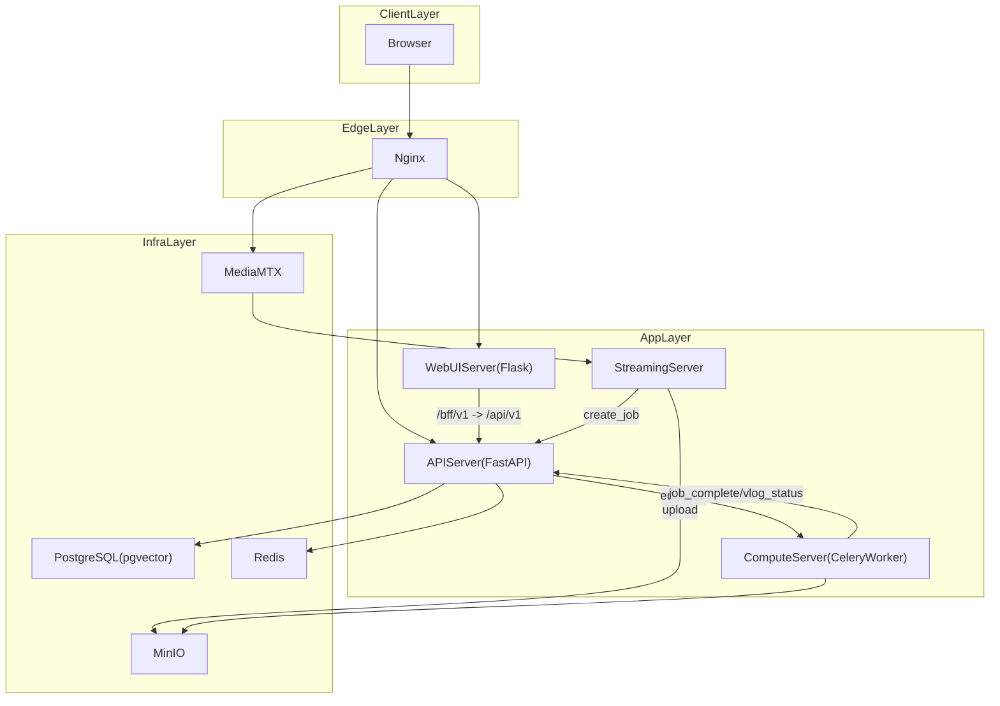
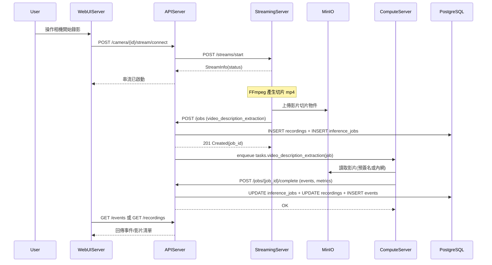

## 3. 系統架構設計

### 3.0 本章目的說明
本章說明「回憶拾光」的架構風格、子系統/模組邊界，以及服務間的互動與資料流。內容需能對應到實際服務組成（Docker Compose）與程式碼模組，並提供可驗證的服務互動描述。

### 3.0 本章涵蓋範圍
- **架構風格與部署形態**：Client-Server、Service-Oriented、容器化部署
- **整體架構與元件清單**：以 `deploy/docker-compose.yml` 之服務為主
- **子系統與模組邊界**：WebUI/API/Streaming/Compute/Infra 的責任與介面
- **資料流與服務互動**：錄影/推論/日記/回憶短片/查詢之主要鏈路
- **圖表**：系統架構圖、服務互動/資料流圖（Mermaid）

### 3.1 系統架構風格
- **Client-Server**：使用者透過瀏覽器（Client）操作 Web UI，經由後端 API 取得資料與觸發行為。
- **Service-Oriented（多服務分工）**：將「Web UI、API、串流錄影、AI 計算」拆分為獨立服務，彼此以 HTTP/內網服務名稱互通。
- **非同步任務導向**：事件偵測、回憶短片生成、embedding 生成屬耗時工作，透過 Celery 非同步執行並以資料庫追蹤狀態。
- **媒體與結構化資料分離**：
  - 媒體檔（影片/縮圖/音樂）以 **MinIO 物件儲存** 管理。
  - 結構化資料（使用者、事件、任務、索引資訊）以 **PostgreSQL** 管理。

### 3.2 系統整體架構（對應實際系統）
本系統的服務組成以 `deploy/docker-compose.yml` 為事實來源，核心服務如下：

- **WebUIServer（Flask）**：`services/WebUIServer/app/app.py`
  - 提供頁面模板與靜態資源（`services/WebUIServer/app/template/`、`services/WebUIServer/app/static/`）
  - 透過 BFF Proxy：`/bff/v1/<path>` 轉送到 APIServer：`/api/v1/<path>`
- **APIServer（FastAPI）**：`services/APIServer/app/main.py`
  - API 路由群：`services/APIServer/app/router/*/service.py`
  - 存取資料層：`services/APIServer/app/DataAccess/tables/*.py`
  - 認證授權：JWT / API Key
- **StreamingServer（FastAPI）**：`services/StreamingServer/app/main.py`
  - 串流管理：`/streams/start|stop|update|list`
  - FFmpeg 錄影切片、將切片檔寫入 record_root
  - uploader 背景任務（watchdog 監控檔案）上傳 MinIO 並呼叫 APIServer 建立推論 job
- **ComputeServer（Celery Worker）**：`services/ComputeServer/app/main.py` + `services/ComputeServer/app/tasks/*`
  - 影片事件偵測（抽幀、BLIP caption、LLM 事件切割）
  - 回憶短片生成（剪輯合併、音樂、縮圖、上傳、回報狀態）
  - embedding/RAG 任務（事件 embedding、日記 chunks embedding、highlight selection）
- **Infra**：
  - PostgreSQL（含 pgvector）：`deploy/docker-compose.yml` 之 `postgres`
  - Redis（Celery broker/快取）：`redis`
  - MinIO（物件儲存）：`minio`
  - MediaMTX（RTSP/WebRTC 路由）：`mediamtx`
  - Nginx（入口與 RTSP TCP 代理）：`nginx`

### 3.3 子系統與模組劃分（責任邊界）

#### 3.3.1 WebUIServer（展示層 + BFF）
- **責任**：提供使用者操作介面；將前端對 API 的呼叫統一代理至 APIServer。
- **邊界**：不直接操作資料庫、不直接處理 AI 任務；所有資料寫入由 APIServer 負責。

#### 3.3.2 APIServer（業務層 + 資料存取層入口）
- **責任**：
  - 使用者/管理員的認證授權
  - CRUD 與查詢（攝影機、錄影、事件、日記、回憶短片、音樂）
  - 任務派送（enqueue Celery）與任務追蹤（`inference_jobs`）
  - 產出 presigned URL（供瀏覽器播放/下載）
- **邊界**：
  - 不進行重度影片處理
  - 以 HTTP 呼叫 StreamingServer 來開始/停止錄影

#### 3.3.3 StreamingServer（串流錄影層）
- **責任**：
  - 管理 FFmpeg 拉流/錄影進程
  - 依切片規則生成 mp4 檔
  - uploader 將檔案上傳 MinIO，並呼叫 APIServer 建立推論 job
- **邊界**：
  - 不做 AI 推論；只負責「取得來源影像」與「可靠上傳/派工觸發」。

#### 3.3.4 ComputeServer（AI 計算層）
- **責任**：
  - 執行 Celery 任務（影片理解、回憶短片生成、embedding/RAG）
  - 任務完成後回報 APIServer（或直接更新 DB，依任務設計）
- **邊界**：
  - 不提供對外 UI
  - 不作為主要 API 入口（以內部任務與回報為主）

#### 3.3.5 Infra（資料與網路基礎設施）
- **PostgreSQL**：保存結構化資料與向量（pgvector）。
- **Redis**：Celery broker/快取（依設定）。
- **MinIO**：保存影片、縮圖、音樂等大型檔案。
- **MediaMTX**：提供 RTSP/WebRTC 的 publish/read 路由。
- **Nginx**：對外入口（HTTP/HTTPS），並可代理 RTSP TCP。

### 3.4 系統資料流與服務互動說明
本節以「可追溯到實作」的方式，描述主要資料流。

#### 3.4.1 串流 → 錄影切片 → 上傳 → 建立推論任務
- **入口**：使用者於 Web UI 操作相機連線，APIServer 產生內部拉流 URL 並呼叫 StreamingServer 開始錄影（`Camera/service.py` → `StreamingServer /streams/start`）。
- **錄影切片**：StreamingServer 管理 FFmpeg 進程，將 mp4 切片寫入 record_root（依 user_id/camera_id/日期目錄）。
- **上傳與派工**：uploader 監控新檔，檔案穩定後上傳至 MinIO，並呼叫 APIServer `/jobs` 建立推論 job（video_description_extraction）。
- **落點**：
  - MinIO：影片檔物件
  - PostgreSQL：建立 `recordings`、`inference_jobs`，等待 ComputeServer 回報事件

#### 3.4.2 推論任務 → 事件切割 → 回寫資料庫
- **ComputeServer** 取得 job 內容後，對影片進行抽幀、caption、LLM 事件切割，生成 `events`，並回呼 APIServer `/jobs/{job_id}/complete`。
- APIServer 完成：
  - 更新 `inference_jobs.status/metrics/error_message`
  - 更新 `recordings.is_processed/start_time/end_time`
  - 新增 `events`（含 embedding 或觸發後續 embedding 任務）

#### 3.4.3 日記摘要（手動刷新/自動刷新）
- **手動**：Web UI 觸發 `POST /chat/diary/summary`，APIServer 讀取當日事件後調用 LLM 生成摘要並寫入 `diary`。
- **自動**：APIServer lifespan 啟動 `diary_refresh_scheduler`，依使用者設定的最小間隔刷新「今天日記」。

#### 3.4.4 回憶短片（Vlog）
- Web UI 由事件列表選擇事件（手動或 AI 推薦），呼叫 APIServer `POST /vlogs` 建立 `vlogs` 與 `vlog_segments`，並投遞 Compute 任務 `tasks.generate_vlog`。
- ComputeServer 剪輯/合併/加音樂/生成縮圖/上傳後，以內部端點回報狀態：`PATCH /vlogs/internal/{vlog_id}/status`。

---

### 3.5 系統架構圖（Mermaid）

### 3.6 服務互動示意圖（Mermaid）
以下以「錄影切片→上傳→事件推論→結果回寫」描述跨服務互動；錯誤分支會在第 4 章更細緻呈現。

