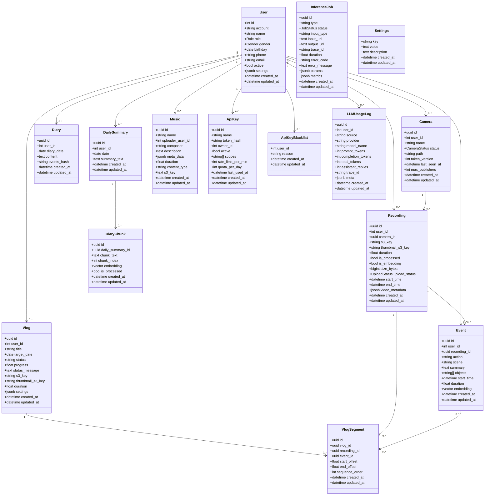
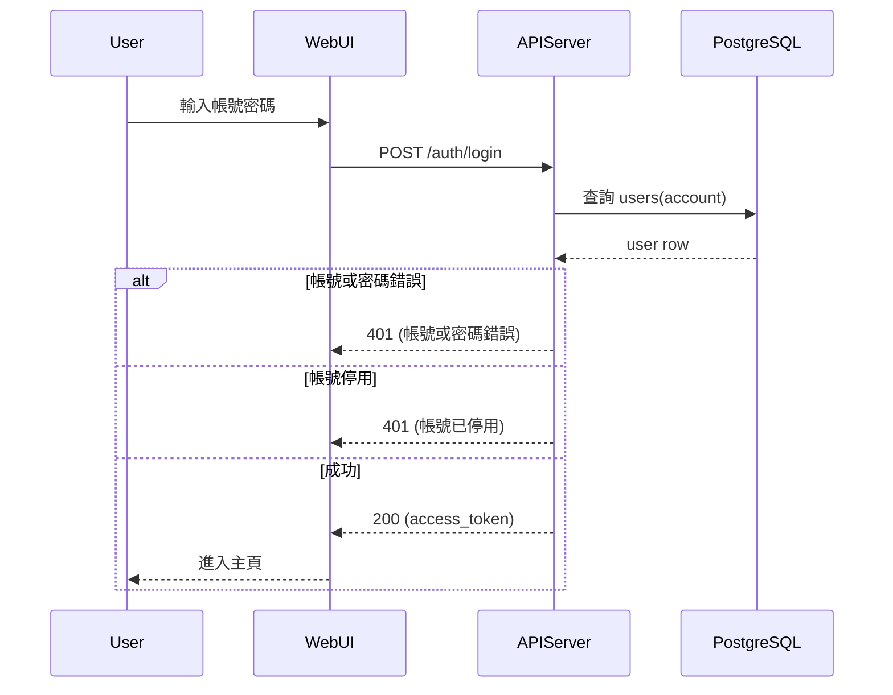
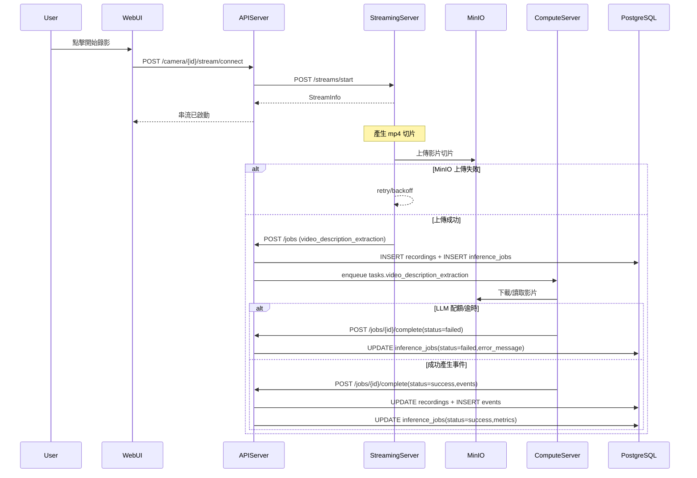
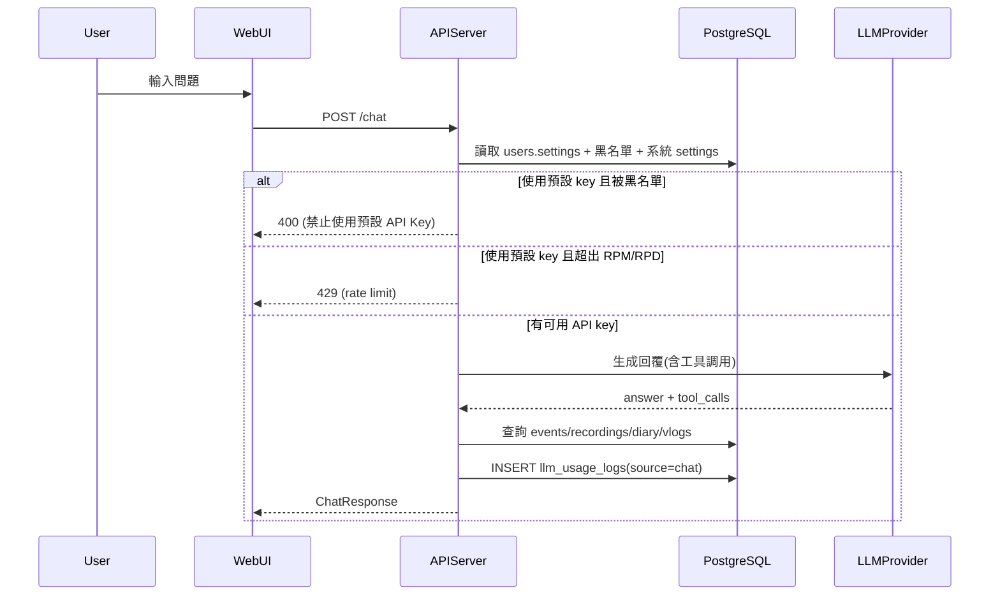
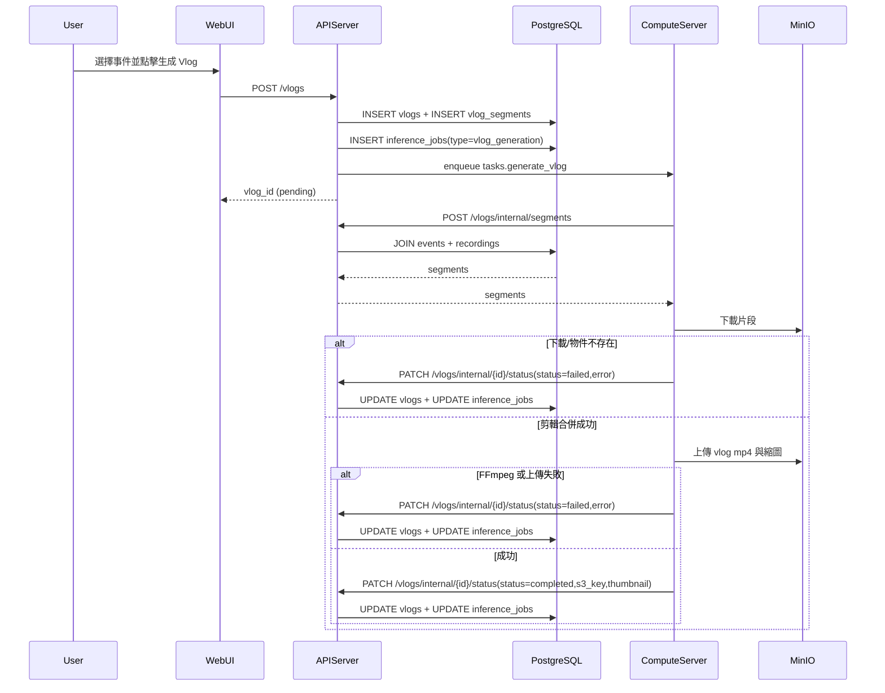

## 4. 功能設計

### 4.0 本章目的說明
本章目的在於「完整描述回憶拾光所有功能的行為、觸發方式、處理流程與輸出結果」，並使每一項功能可對照到實際系統元件（WebUIServer/APIServer/StreamingServer/ComputeServer）與資料來源（PostgreSQL/MinIO/Redis）。

### 4.0 本章涵蓋範圍
- **功能模組分類原則**（章首規範）
- **前端功能設計**：使用者透過 Web UI 觸發的行為
- **後端功能設計**：APIServer 提供的 API 端點（含內部 M2M 端點）
- **背景作業與自動化流程**：Streaming/Compute/APIServer scheduler
- **例外處理與錯誤流程**：跨模組共通錯誤與補償策略
- **圖表**：類別圖、主要循序圖（含錯誤分支）

---

### 4.1 功能模組概述與分類原則

#### 4.1.1 分類原則（本章統一口徑）
- **前端功能（FE-*）**：由使用者在瀏覽器操作觸發，對應 `services/WebUIServer/app/template/*.html` 與 `services/WebUIServer/app/static/js/*.js`。
- **後端功能（BE-*）**：由 WebUI 或服務呼叫 APIServer 的端點觸發，對應 `services/APIServer/app/router/*/service.py`。
- **背景作業（BJ-*）**：由系統自動執行或排程觸發的流程，對應 StreamingServer/ComputeServer/APIServer scheduler。

#### 4.1.2 功能描述模板（每一功能皆具備）
- **功能名稱與編號**
- **觸發方式**（UI 操作 / API 呼叫 / 系統排程）
- **輸入資料**（必要參數、來源）
- **處理流程**（逐步，含關鍵判斷）
- **輸出結果**（回應/狀態/副作用）
- **涉及之系統元件或資料**（服務、資料表、MinIO key 類型）

---

### 4.2 前端功能設計（User 透過前端操作觸發）

> 前端頁面由 Flask 提供模板，主要行為由對應 JS 模組呼叫 `/bff/v1/*` 轉送至 APIServer。頁面對應如下（可驗證）：
> - 模板：`services/WebUIServer/app/template/`
> - JS：`services/WebUIServer/app/static/js/`

#### FE-AUTH-01 登入/註冊頁
- **對應頁面/程式**：`auth.html` + `sign_login.js`
- **觸發方式**：使用者輸入帳號密碼並提交
- **輸入資料**：account/password（表單）
- **處理流程**：
  - 呼叫後端登入或註冊 API
  - 成功後保存 JWT（通常於瀏覽器儲存）並導向主頁
- **輸出結果**：登入成功 token、或錯誤訊息
- **涉及元件/資料**：APIServer `auth` 路由、`users` 表

#### FE-HOME-01 主頁（今日摘要：日記 + 今日 Vlog）
- **對應頁面/程式**：`home.html` + `home.js` / `diary.js` / `vlog.js`
- **觸發方式**：進入主頁、切換日期、點擊「重新整理日記」/「生成 Vlog」
- **輸入資料**：選擇日期、（生成 Vlog 時）事件選擇結果、Vlog 設定（音樂、解析度、max_duration）
- **處理流程**：
  - 讀取指定日期的日記（或觸發日記生成/刷新）
  - 讀取指定日期的最新 Vlog（狀態/進度/錯誤）
  - 生成 Vlog：彈窗載入事件列表（可 AI 推薦），確認後送出建立 Vlog
- **輸出結果**：日記內容、Vlog 播放/縮圖、任務狀態與進度
- **涉及元件/資料**：`diary`、`events`、`vlogs`、`vlog_segments`、`inference_jobs`、MinIO 影片/縮圖/音樂

#### FE-CAMERA-01 鏡頭串流管理
- **對應頁面/程式**：`camera.html` + `camera.js` / `services/CameraService.js`
- **觸發方式**：新增鏡頭、取得推流 URL、開始/停止錄影、查詢串流狀態
- **輸入資料**：camera name、ttl、segment_seconds（可由系統設定）
- **處理流程**：
  - 新增鏡頭（建立 DB 記錄）
  - 取得 RTSP publish URL（含 token）供推流端使用
  - 開始錄影：呼叫 connect/stream API，由 StreamingServer 啟動 FFmpeg
  - 停止錄影：呼叫 stop API
- **輸出結果**：鏡頭清單、推流 URL、串流狀態
- **涉及元件/資料**：`camera`、StreamingServer、MediaMTX

#### FE-REC-01 影片管理（錄影列表/播放/刪除/事件列表）
- **對應頁面/程式**：`recordings.html` + `recordings.js`
- **觸發方式**：查詢錄影列表、點擊播放/下載、刪除錄影、查看該錄影事件
- **輸入資料**：keywords、sr（查詢範圍）、start_time/end_time、sort、page/size
- **處理流程**：
  - 呼叫後端列出 recordings
  - 取得指定錄影的 presigned URL 播放/下載
  - 取得指定錄影底下 events
  - 刪除錄影：同時刪除 MinIO 物件與 DB 記錄
- **輸出結果**：錄影清單、播放 URL、事件清單
- **涉及元件/資料**：`recordings`、`events`、MinIO

#### FE-EVENTS-01 事件檢視（列表/編輯/刪除）
- **對應頁面/程式**：`events.html` + `events.js` / `services/EventService.js`
- **觸發方式**：查詢事件、點擊編輯/刪除
- **輸入資料**：時間範圍、keywords、sr、sort、page/size
- **處理流程**：
  - 呼叫後端 list events
  - 編輯事件：PATCH event
  - 刪除事件：DELETE event
- **輸出結果**：事件列表更新
- **涉及元件/資料**：`events`

#### FE-CHAT-01 AI 助手（自然語言查詢）
- **對應頁面/程式**：`chat.html` + `chat.js`
- **觸發方式**：使用者送出訊息
- **輸入資料**：message、history、date_from/date_to（可選）
- **處理流程**：
  - 呼叫後端 chat 端點
  - 顯示回覆、以及關聯事件/影片/日記/Vlog
- **輸出結果**：AI 回覆與關聯資料
- **涉及元件/資料**：`events`、`recordings`、`diary`、`vlogs`、LLM 使用統計

#### FE-SET-01 使用者設定
- **對應頁面/程式**：`user_profile.html` + `user_profile.js` / `settings.js`
- **觸發方式**：修改基本資料、修改密碼、更新偏好設定（時區/LLM/自動刷新等）
- **輸入資料**：profile 欄位、old/new password、settings patch
- **處理流程**：呼叫 user profile/settings API
- **輸出結果**：設定保存成功或錯誤
- **涉及元件/資料**：`users.settings`、`api_key_blacklist`（影響是否可用預設 key）

#### FE-ADMIN-01 管理員頁（任務/使用者/音樂庫/系統設定）
- **對應頁面/程式**：
  - `admin_tasks.html` + `admin_tasks.js`
  - `admin_users.html` + `admin_users.js`
  - `admin_music.html` + `admin_music.js`
  - `admin_settings.html` + `admin_settings.js`
- **觸發方式**：管理員操作 UI
- **輸入資料**：系統設定值（LLM 預設、影片參數、用量限制）、黑名單操作、音樂上傳
- **處理流程**：呼叫 admin/music 等管理 API
- **輸出結果**：設定更新、任務列表、使用者統計、音樂庫變更
- **涉及元件/資料**：`settings`、`api_keys`、`api_key_blacklist`、`llm_usage_logs`、`music`、`inference_jobs`

---

### 4.3 後端功能設計（APIServer 提供之功能）

> 後端路由可驗證來源：`services/APIServer/app/router/*/service.py`。

#### BE-AUTH-01 使用者註冊
- **觸發方式**：`POST /api/v1/auth/signup`
- **輸入資料**：SignupRequestDTO
- **處理流程**：檢查 account/email/phone 唯一 → 建立 users → 發 JWT
- **輸出結果**：access_token
- **涉及資料**：`users`

#### BE-AUTH-02 管理員註冊
- **觸發方式**：`POST /api/v1/auth/signup-admin`
- **輸入資料**：SignupRequestDTO
- **處理流程**：同 BE-AUTH-01，但 role=admin
- **輸出結果**：access_token
- **涉及資料**：`users`

#### BE-AUTH-03 使用者登入
- **觸發方式**：`POST /api/v1/auth/login`
- **輸入資料**：OAuth2 form（username/password）
- **處理流程**：驗證密碼/active → 發 JWT
- **輸出結果**：access_token
- **涉及資料**：`users`

#### BE-M2M-01 M2M 健康檢查
- **觸發方式**：`GET /api/v1/m2m/ping`
- **輸入資料**：`X-API-Key`
- **處理流程**：驗證 API key → 回傳 owner
- **輸出結果**：{msg, owner_id}
- **涉及資料**：`api_keys`

#### BE-M2M-02 MediaMTX 串流密碼檢查
- **觸發方式**：`POST /api/v1/m2m/check-stream-pwd`
- **輸入資料**：protocol/action/path/token（由 MediaMTX 傳入）
- **處理流程**：驗 JWT（aud/action/cid）→ 驗 path 對應 camera.id
- **輸出結果**：200 或 401
- **涉及資料**：`camera`（path/token_version）

#### BE-USER-01 取得目前使用者資料
- **觸發方式**：`GET /api/v1/users/me`
- **輸入資料**：Bearer JWT
- **處理流程**：回傳 public_user
- **輸出結果**：user
- **涉及資料**：`users`

#### BE-USER-02 更新使用者基本資料
- **觸發方式**：`PATCH /api/v1/users/me`
- **輸入資料**：UpdateUserProfileDTO
- **處理流程**：檢查 email 唯一 → 更新 users
- **輸出結果**：更新結果
- **涉及資料**：`users`

#### BE-USER-03 修改密碼
- **觸發方式**：`PUT /api/v1/users/me/password`
- **輸入資料**：old_password/new_password
- **處理流程**：驗舊密碼 → hash 新密碼 → 更新
- **輸出結果**：msg
- **涉及資料**：`users.password_hash`

#### BE-USER-04 刷新 JWT
- **觸發方式**：`GET /api/v1/users/token/refresh`
- **輸入資料**：Bearer JWT
- **處理流程**：重新簽發 token
- **輸出結果**：access_token
- **涉及資料**：無（JWT 發行）

#### BE-USER-05 讀取使用者設定
- **觸發方式**：`GET /api/v1/users/settings`
- **輸入資料**：Bearer JWT
- **處理流程**：讀取 users.settings（或預設）
- **輸出結果**：settings
- **涉及資料**：`users.settings`

#### BE-USER-06 更新使用者設定
- **觸發方式**：`PATCH /api/v1/users/settings`
- **輸入資料**：UpdateUserSettingsRequest
- **處理流程**：更新 settings → 若 LLM 配置變更則清理 LLM model instance
- **輸出結果**：settings
- **涉及資料**：`users.settings`、`api_key_blacklist`、`settings`（系統預設 LLM）

#### BE-CAM-01 新增相機
- **觸發方式**：`POST /api/v1/camera/`
- **輸入資料**：CameraCreate
- **處理流程**：
  - 依角色決定 target_user_id
  - 建立 camera（status/token_version/path）
- **輸出結果**：CameraRead
- **涉及資料**：`camera`

#### BE-CAM-02 更新相機
- **觸發方式**：`PATCH /api/v1/camera/{id}`
- **輸入資料**：CameraUpdate
- **處理流程**：權限檢查（admin/owner）→ patch
- **輸出結果**：Ok
- **涉及資料**：`camera`

#### BE-CAM-03 刪除相機（邏輯刪除）
- **觸發方式**：`DELETE /api/v1/camera/{id}`
- **輸入資料**：id
- **處理流程**：權限檢查 → status=deleted
- **輸出結果**：Ok
- **涉及資料**：`camera.status`

#### BE-CAM-04 列出相機
- **觸發方式**：`GET /api/v1/camera/`
- **輸入資料**：user_id/status/q/page/size
- **處理流程**：權限檢查 → query + 分頁
- **輸出結果**：items/total
- **涉及資料**：`camera`

#### BE-CAM-05 取得相機
- **觸發方式**：`GET /api/v1/camera/{id}`
- **輸入資料**：id
- **處理流程**：權限檢查
- **輸出結果**：CameraRead
- **涉及資料**：`camera`

#### BE-CAM-06 更新相機狀態
- **觸發方式**：`PATCH /api/v1/camera/{id}/status`
- **輸入資料**：CameraStatusReq
- **處理流程**：權限檢查 → 更新 status
- **輸出結果**：Ok
- **涉及資料**：`camera.status`

#### BE-CAM-07 旋轉 token_version
- **觸發方式**：`POST /api/v1/camera/{id}/token/version-rotate`
- **輸入資料**：id
- **處理流程**：權限檢查 → token_version += 1
- **輸出結果**：token_version
- **涉及資料**：`camera.token_version`

#### BE-CAM-08 建立串流連線並開始錄影
- **觸發方式**：`POST /api/v1/camera/{id}/stream/connect`
- **輸入資料**：GenerateTokenReq（ttl、segment_seconds 等）
- **處理流程**：
  - 驗 camera active/權限
  - 簽發 internal read token 供 StreamingServer 拉流
  - 呼叫 StreamingServer `/streams/start`
- **輸出結果**：StreamConnectResp
- **涉及元件/資料**：`camera`、`settings(video_segment_seconds)`、StreamingServer

#### BE-CAM-09 停止錄影
- **觸發方式**：`POST /api/v1/camera/{id}/stream/stop`
- **輸入資料**：id
- **處理流程**：呼叫 StreamingServer `/streams/stop`
- **輸出結果**：Ok
- **涉及元件**：StreamingServer

#### BE-CAM-10 取得 RTSP 推流 URL
- **觸發方式**：`GET /api/v1/camera/{id}/publish_rtsp_url`
- **輸入資料**：ttl
- **處理流程**：簽發 publish token（aud=rtsp）→ 組成 RTSP URL
- **輸出結果**：PublishRTSPURLResp
- **涉及元件/資料**：`camera.path/token_version`、MediaMTX

#### BE-CAM-11 查詢串流狀態
- **觸發方式**：`GET /api/v1/camera/{id}/stream/status`
- **輸入資料**：id
- **處理流程**：向 StreamingServer `GET /streams` 查詢
- **輸出結果**：StreamStatusResp
- **涉及元件**：StreamingServer

#### BE-CAM-12 取得 WebRTC 播放 URL
- **觸發方式**：`GET /api/v1/camera/{id}/play-webrtc-url`
- **輸入資料**：ttl
- **處理流程**：簽發 read token（aud=webrtc）→ 組成 URL
- **輸出結果**：PlayWebRTCURLResp
- **涉及元件**：MediaMTX

#### BE-CAM-13 串流 token 延長（refresh）
- **觸發方式**：`GET /api/v1/camera/{id}/token/refresh/{audience}?token=...`
- **輸入資料**：audience、舊 token
- **處理流程**：驗舊 token（aud/ver/cid/action）→ 重簽 token
- **輸出結果**：RefreshTokenResp
- **涉及資料**：`camera.token_version`

#### BE-REC-01 取得錄影播放/下載 URL（含縮圖 URL）
- **觸發方式**：`GET /api/v1/recordings/{recording_id}`
- **輸入資料**：ttl/disposition/filename/asset_type
- **處理流程**：權限檢查 → 依 s3_key/thumbnail_s3_key 產 presigned URL
- **輸出結果**：RecordingUrlResp
- **涉及資料**：`recordings`、MinIO

#### BE-REC-02 刪除錄影（硬刪）
- **觸發方式**：`DELETE /api/v1/recordings/{recording_id}`
- **輸入資料**：recording_id
- **處理流程**：權限檢查 → 刪 MinIO 物件 → 刪關聯 events → 刪 recordings
- **輸出結果**：Ok
- **涉及資料**：`recordings`、`events`、MinIO

#### BE-REC-03 查詢錄影列表
- **觸發方式**：`GET /api/v1/recordings`
- **輸入資料**：keywords/sr/start_time/end_time/sort/page/size
- **處理流程**：權限檢查 → time predicate（依使用者時區轉 UTC）→ exists 子查詢 events
- **輸出結果**：RecordingListResp（含 summary、時間已轉使用者時區）
- **涉及資料**：`recordings`、`events`

#### BE-REC-04 [M2M] 回寫錄影縮圖路徑
- **觸發方式**：`PATCH /api/v1/m2m/recordings/{recording_id}/thumbnail`
- **輸入資料**：thumbnail_s3_key
- **處理流程**：更新 recordings.thumbnail_s3_key
- **輸出結果**：ok
- **涉及資料**：`recordings.thumbnail_s3_key`

#### BE-REC-05 取得錄影底下事件
- **觸發方式**：`GET /api/v1/recordings/{recording_id}/events`
- **輸入資料**：sort
- **處理流程**：先權限驗證該 recording → query events
- **輸出結果**：EventRead list
- **涉及資料**：`events`

#### BE-EVT-01 查詢事件列表
- **觸發方式**：`GET /api/v1/events`
- **輸入資料**：recording_id/user_id(start for admin)/start_time/end_time/keywords/sr/sort/page/size
- **處理流程**：權限 → 時區轉換 → keyword scope OR
- **輸出結果**：EventListResp
- **涉及資料**：`events`

#### BE-EVT-02 取得事件
- **觸發方式**：`GET /api/v1/events/{event_id}`
- **輸入資料**：event_id
- **處理流程**：查詢 → 轉換時間到使用者時區
- **輸出結果**：EventRead
- **涉及資料**：`events`

#### BE-EVT-03 更新事件
- **觸發方式**：`PATCH /api/v1/events/{event_id}`
- **輸入資料**：EventUpdate
- **處理流程**：patch 更新
- **輸出結果**：Ok
- **涉及資料**：`events`

#### BE-EVT-04 刪除事件
- **觸發方式**：`DELETE /api/v1/events/{event_id}`
- **輸入資料**：event_id
- **處理流程**：刪除 DB row
- **輸出結果**：Ok
- **涉及資料**：`events`

#### BE-JOB-01 建立推論任務（Uploader→API）
- **觸發方式**：`POST /api/v1/jobs`
- **輸入資料**：JobCreateDTO（type/input_type/input_url/params）+ `X-API-Key`
- **處理流程**：
  - 若需要 LLM（video_description_extraction），根據 user 設定注入 google_api_key
  - video input：依 s3_key 去重，建立或複用 recordings
  - 建立 inference_jobs（pending）
  - enqueue Celery 任務
- **輸出結果**：job_id/trace_id/status
- **涉及資料**：`recordings`、`inference_jobs`、`users.settings`、`settings(default_google_api_key)`

#### BE-JOB-02 查詢單一 job
- **觸發方式**：`GET /api/v1/jobs/{job_id}`
- **輸入資料**：job_id
- **處理流程**：權限（非 admin 只能看自己的 params.user_id）
- **輸出結果**：JobGetRespDTO
- **涉及資料**：`inference_jobs`

#### BE-JOB-03 查詢 job 狀態
- **觸發方式**：`GET /api/v1/jobs/{job_id}/status`
- **輸入資料**：job_id
- **處理流程**：同 BE-JOB-02
- **輸出結果**：status
- **涉及資料**：`inference_jobs`

#### BE-JOB-04 查詢 job 列表
- **觸發方式**：`GET /api/v1/jobs`
- **輸入資料**：status_filter/page/size
- **處理流程**：一般使用者以 params.user_id 過濾
- **輸出結果**：JobListRespDTO
- **涉及資料**：`inference_jobs`

#### BE-JOB-05 [內部] job 狀態更新
- **觸發方式**：`PATCH /api/v1/jobs/{job_id}/update_status`
- **輸入資料**：JobStatus
- **處理流程**：更新 inference_jobs.status
- **輸出結果**：status
- **涉及資料**：`inference_jobs`

#### BE-JOB-06 Compute 回報 job 完成
- **觸發方式**：`POST /api/v1/jobs/{job_id}/complete`
- **輸入資料**：JobCompleteDTO + `X-API-Key`
- **處理流程**：
  - 更新 inference_jobs（status/metrics/error）
  - 若 success：更新 recordings（is_processed、start/end_time、duration）
  - 若有 events：INSERT events（含 embedding）；若缺 embedding 觸發 embedding_generation 任務
  - 記錄 token 使用量（寫入 llm_usage_logs；source=compute）
- **輸出結果**：ok
- **涉及資料**：`inference_jobs`、`recordings`、`events`、`llm_usage_logs`

#### BE-CHAT-01 AI 助手對話
- **觸發方式**：`POST /api/v1/chat`
- **輸入資料**：ChatRequest（message/history/date_from/date_to/max_results）
- **處理流程**：
  - 依使用者設定取得 LLM provider/model/api_key
  - 若使用預設 key：依 settings.default_ai_key_limits 做限流（RPM/RPD），黑名單禁止
  - 呼叫 LLM（允許 function calling）檢索 events/recordings/diaries/vlogs
  - 記錄 token 使用量（source=chat，assistant_replies=1）
- **輸出結果**：ChatResponse（message + 關聯資料）
- **涉及資料**：`events`、`recordings`、`diary`、`vlogs`、`settings`、`api_key_blacklist`、`llm_usage_logs`

#### BE-CHAT-02 取得聊天/限流狀態
- **觸發方式**：`GET /api/v1/chat/stats`
- **輸入資料**：Bearer JWT
- **處理流程**：回傳 rate limit stats 與 LLM manager stats
- **輸出結果**：stats dict
- **涉及資料**：`settings(default_ai_key_limits)`

#### BE-CHAT-03 [管理] 清理使用者模型實例
- **觸發方式**：`DELETE /api/v1/chat/cleanup/{user_id}`
- **輸入資料**：user_id
- **處理流程**：admin only → 強制釋放模型實例
- **輸出結果**：message
- **涉及元件**：UserLLMManager

#### BE-CHAT-04 生成/刷新日記摘要
- **觸發方式**：`POST /api/v1/chat/diary/summary`
- **輸入資料**：diary_date、force_refresh
- **處理流程**：
  - 依日期查 events
  - 計算 events_hash；若不同才調用 LLM 生成摘要
  - 寫入/更新 diary
  - 建立 inference_jobs（diary_generation）供管理頁追蹤
- **輸出結果**：DiarySummaryResponse
- **涉及資料**：`events`、`diary`、`inference_jobs`、`llm_usage_logs`

#### BE-CHAT-05 取得指定日記（不刷新）
- **觸發方式**：`GET /api/v1/chat/diary/{diary_date}`
- **輸入資料**：diary_date
- **處理流程**：查 diary + 查當日事件數
- **輸出結果**：DiarySummaryResponse
- **涉及資料**：`diary`、`events`

#### BE-DIARY-01 產生日記 embeddings
- **觸發方式**：`POST /api/v1/diary/generate-embeddings/{date_str}`
- **輸入資料**：date_str
- **處理流程**：將 diary.content chunk → enqueue `tasks.generate_diary_embeddings` →（目前同步等待結果）
- **輸出結果**：chunks_count
- **涉及資料**：`diary`、`diary_chunks`、`inference_jobs`

#### BE-DIARY-02 刪除日記 embeddings
- **觸發方式**：`DELETE /api/v1/diary/embeddings/{date_str}`
- **輸入資料**：date_str
- **處理流程**：刪除 diary_chunks
- **輸出結果**：success
- **涉及資料**：`diary_chunks`

#### BE-VLOG-01 取得指定日期事件（手動選擇）
- **觸發方式**：`GET /api/v1/vlogs/events/{target_date}`
- **輸入資料**：target_date
- **處理流程**：以使用者時區換算日界 → 查詢 events
- **輸出結果**：DateEventsResponse
- **涉及資料**：`events`

#### BE-VLOG-02 AI 推薦事件（RAG）
- **觸發方式**：`POST /api/v1/vlogs/ai-select`
- **輸入資料**：date、limit、summary_text（可選）
- **處理流程**：
  - 讀取當日 events
  - 取 diary.content 或 fallback query
  - enqueue `tasks.suggest_vlog_highlights`（若無結果後端則本地 BM25 fallback）
  - 建立 inference_jobs（rag_highlights）追蹤
- **輸出結果**：selected_event_ids
- **涉及資料**：`events`、`diary`、`inference_jobs`

#### BE-VLOG-03 建立 Vlog 任務
- **觸發方式**：`POST /api/v1/vlogs`
- **輸入資料**：title/target_date/event_ids/max_duration/resolution/music 設定
- **處理流程**：
  - 驗證事件屬於使用者、同一天
  - 建立 vlogs（pending）與 vlog_segments
  - 建立 inference_jobs（vlog_generation）並把 job_id 存回 vlogs.settings
  - enqueue `tasks.generate_vlog`
- **輸出結果**：vlog_id/status
- **涉及資料**：`vlogs`、`vlog_segments`、`events`、`music`、`inference_jobs`

#### BE-VLOG-04 列出 Vlog
- **觸發方式**：`GET /api/v1/vlogs`
- **輸入資料**：skip/limit/status
- **處理流程**：查詢 vlogs
- **輸出結果**：VlogListResponse
- **涉及資料**：`vlogs`

#### BE-VLOG-05 依日期取得最新 Vlog
- **觸發方式**：`GET /api/v1/vlogs/date/{target_date}`
- **輸入資料**：target_date
- **處理流程**：查詢 vlogs（同 user/date，取最新）；必要時同步 inference_jobs 失敗狀態
- **輸出結果**：DailyVlogResponse
- **涉及資料**：`vlogs`、`inference_jobs`

#### BE-VLOG-06 取得 Vlog 詳情（含 segments）
- **觸發方式**：`GET /api/v1/vlogs/{vlog_id}`
- **輸入資料**：vlog_id
- **處理流程**：查 vlogs + 查 vlog_segments
- **輸出結果**：VlogDetailResponse
- **涉及資料**：`vlogs`、`vlog_segments`

#### BE-VLOG-07 取得 Vlog 播放 URL
- **觸發方式**：`GET /api/v1/vlogs/{vlog_id}/url`
- **輸入資料**：ttl
- **處理流程**：檢查 completed + s3_key → 產 presigned
- **輸出結果**：VlogUrlResponse
- **涉及資料**：`vlogs`、MinIO

#### BE-VLOG-08 取得 Vlog 縮圖 URL
- **觸發方式**：`GET /api/v1/vlogs/{vlog_id}/thumbnail-url`
- **輸入資料**：ttl
- **處理流程**：依 thumbnail_s3_key 產 presigned
- **輸出結果**：VlogUrlResponse
- **涉及資料**：`vlogs.thumbnail_s3_key`、MinIO

#### BE-VLOG-09 刪除 Vlog
- **觸發方式**：`DELETE /api/v1/vlogs/{vlog_id}`
- **輸入資料**：vlog_id
- **處理流程**：刪除 MinIO 物件（best-effort）→ 刪 DB（CASCADE 刪 segments）
- **輸出結果**：ok
- **涉及資料**：`vlogs`、MinIO

#### BE-VLOG-10 [內部] Compute 取得事件對應錄影片段
- **觸發方式**：`POST /api/v1/vlogs/internal/segments`
- **輸入資料**：event_ids + `X-API-Key`
- **處理流程**：join events-recordings 計算 start_offset/duration
- **輸出結果**：segments list
- **涉及資料**：`events`、`recordings`

#### BE-VLOG-11 [內部] Compute 回報 Vlog 狀態
- **觸發方式**：`PATCH /api/v1/vlogs/internal/{vlog_id}/status`
- **輸入資料**：status/progress/status_message/s3_key/thumbnail_s3_key/error_message/job_id + `X-API-Key`
- **處理流程**：更新 vlogs；completed 時清理同日舊 vlog；同步 inference_jobs
- **輸出結果**：VlogStatusUpdateResponse
- **涉及資料**：`vlogs`、`inference_jobs`、MinIO

#### BE-MUSIC-01 列出音樂
- **觸發方式**：`GET /api/v1/music`
- **輸入資料**：skip/limit
- **處理流程**：join users 取 uploader_name
- **輸出結果**：MusicListResponse
- **涉及資料**：`music`、`users`

#### BE-MUSIC-02 取得音樂
- **觸發方式**：`GET /api/v1/music/{music_id}`
- **輸入資料**：music_id
- **處理流程**：查詢
- **輸出結果**：MusicRead
- **涉及資料**：`music`

#### BE-MUSIC-03 取得音樂播放 URL
- **觸發方式**：`GET /api/v1/music/{music_id}/url`
- **輸入資料**：ttl
- **處理流程**：產 presigned
- **輸出結果**：MusicUrlResponse
- **涉及資料**：MinIO

#### BE-ADMIN-01 API Key 管理（建立/列出/更新/旋轉）
- **觸發方式**：`POST /api/v1/admin/keys`、`GET /api/v1/admin/keys`、`PATCH /api/v1/admin/keys/{key_id}`、`POST /api/v1/admin/keys/{key_id}/rotate`
- **輸入資料**：owner_id/scopes/rate_limit/quota/active
- **處理流程**：admin only；token 明碼僅在建立/旋轉回傳一次
- **輸出結果**：ApiKeyOutDTO/ApiKeySecretOutDTO
- **涉及資料**：`api_keys`

#### BE-ADMIN-02 系統設定管理（預設 LLM、Google API Key、影片參數、預設 key 限制）
- **觸發方式**：`/api/v1/admin/settings/*`
- **輸入資料**：設定值（JSON）與描述
- **處理流程**：upsert settings
- **輸出結果**：設定值摘要
- **涉及資料**：`settings`

#### BE-ADMIN-03 黑名單管理（禁止使用預設 key）
- **觸發方式**：`POST/GET/DELETE /api/v1/admin/blacklist`
- **輸入資料**：user_id、reason
- **處理流程**：新增/移除條目；新增時同時將 users.settings.use_default_api_key 設為 false（best-effort）
- **輸出結果**：BlacklistEntry
- **涉及資料**：`api_key_blacklist`、`users.settings`

#### BE-ADMIN-04 使用者統計/詳情/啟用狀態
- **觸發方式**：`GET /api/v1/admin/users/stats`、`GET /api/v1/admin/users/{user_id}`、`PATCH /api/v1/admin/users/{user_id}`
- **輸入資料**：user_id、active
- **處理流程**：彙總 llm_usage_logs、黑名單、settings
- **輸出結果**：統計或使用者詳情
- **涉及資料**：`users`、`llm_usage_logs`、`api_key_blacklist`

#### BE-ADMIN-05 任務列表（整合 compute + streaming）
- **觸發方式**：`GET /api/v1/admin/tasks`
- **輸入資料**：status_filter/task_type/page/size
- **處理流程**：
  - 從 inference_jobs 取 compute 任務
  - 從 StreamingServer `/streams` 取 streaming 任務
  - 合併後排序分頁
- **輸出結果**：TaskList
- **涉及元件/資料**：`inference_jobs`、StreamingServer

#### BE-ADMIN-MUSIC-01 管理員音樂庫（上傳/更新/刪除）
- **觸發方式**：`POST/PATCH/DELETE /api/v1/admin/music`
- **輸入資料**：UploadFile、metadata
- **處理流程**：上傳 MinIO → 寫入 music 表；刪除時先刪 MinIO 再刪 DB
- **輸出結果**：MusicAdminRead/ok
- **涉及資料**：`music`、MinIO

---

### 4.4 背景作業與自動化流程（系統自動執行）

#### BJ-STREAM-01 串流錄影管理（FFmpeg 切片）
- **觸發方式**：APIServer 呼叫 StreamingServer `/streams/start|stop|update`
- **輸入資料**：user_id/camera_id/rtsp_url/segment_seconds
- **處理流程**：啟動/停止/更新 FFmpegProcess
- **輸出結果**：stream 狀態（starting/running/reconnecting/error/stopped）
- **涉及元件**：StreamingServer

#### BJ-STREAM-02 uploader：監控切片檔 → 上傳 MinIO → 建立 job
- **觸發方式**：StreamingServer lifespan 啟動 uploader worker
- **輸入資料**：record_root 目錄新增 mp4
- **處理流程**：
  - watchdog/periodic rescan 將檔案入列
  - 等待檔案穩定 → 上傳 MinIO
  - 呼叫 APIServer `POST /jobs` 建立推論 job
  - 入列 delete_queue，確認 S3 物件存在後刪本地檔
- **輸出結果**：MinIO 影片、APIServer job、刪檔完成
- **涉及資料**：MinIO、APIServer jobs、StreamingServer SQLite outbox

#### BJ-COMP-01 影片事件切割（Celery：video_description_extraction）
- **觸發方式**：APIServer enqueue
- **輸入資料**：job（input_url、video_start_time、google_api_key 等）
- **處理流程**：抽幀→過濾→caption→LLM 事件→（可選）embedding→生成縮圖→回報 `/jobs/{id}/complete`
- **輸出結果**：events/metrics，並在 DB 建立事件
- **涉及資料**：MinIO、`recordings`、`events`、`inference_jobs`、`llm_usage_logs`

#### BJ-COMP-02 回憶短片生成（Celery：generate_vlog）
- **觸發方式**：APIServer enqueue
- **輸入資料**：vlog_id/user_id/event_ids/settings
- **處理流程**：取 segments→下載剪輯→合併→加音樂→縮圖→上傳→回報 `/vlogs/internal/{id}/status`
- **輸出結果**：vlogs 完成（s3_key/thumbnail/progress）
- **涉及資料**：MinIO、`vlogs`、`vlog_segments`、`inference_jobs`

#### BJ-COMP-03 embeddings/RAG 任務
- **觸發方式**：APIServer 或使用者觸發
- **任務**：
  - `generate_embeddings_for_recording`：補 events.embedding
  - `generate_diary_embeddings`：產 diary_chunks 向量
  - `suggest_vlog_highlights`：依 query 選擇 event_ids
- **輸出結果**：向量欄位填充、RAG 選擇結果
- **涉及資料**：`events.embedding`、`diary_chunks.embedding`、`inference_jobs`

#### BJ-API-01 日記自動刷新排程
- **觸發方式**：APIServer lifespan 啟動 `diary_refresh_scheduler`
- **輸入資料**：活躍使用者清單 + 使用者設定（auto_refresh/interval/timezone）
- **處理流程**：
  - 取最小刷新間隔 → wait
  - 逐使用者檢查 events_hash 是否改變 → 需要才呼叫 LLM 生成
- **輸出結果**：更新 `diary`
- **涉及資料**：`users.settings`、`diary`、`events`

---

### 4.5 例外處理與錯誤流程（共通彙整）

#### 4.5.1 認證與權限
- **401 未授權**：JWT 過期、缺少 Authorization、API key 無效。
- **403 禁止**：一般使用者嘗試操作他人資源（camera/recordings/events/vlogs）或非 admin 操作 admin 端點。

#### 4.5.2 參數與狀態不一致
- **400 參數錯誤**：日期格式、UUID 格式、segment_seconds 範圍等。
- **409 資源未就緒**：例如 recordings 缺 s3_key 或尚未完成。

#### 4.5.3 外部依賴失敗
- **MinIO 失敗**：上傳/下載/刪除錯誤、presigned URL host 設定錯誤。
- **FFmpeg 失敗**：拉流失敗、剪輯合併失敗、縮圖產生失敗。
- **LLM 失敗**：timeout、429 quota、API key 未配置、黑名單禁止預設 key。

#### 4.5.4 重試與冪等
- **上傳重試**：Streaming uploader 以 outbox + retry/backoff。
- **S3 刪除冪等**：刪除不存在物件視為成功（避免重試造成二次失敗）。
- **任務追蹤**：`inference_jobs` 用於管理頁追蹤，並同步 vlog/job 狀態避免前端卡住。

---

### 4.6 類別圖（Mermaid）

> 註：目前程式碼層同時存在 `diary` 與 `daily_summaries`，且 `diary_chunks.daily_summary_id` FK 指向 `daily_summaries.id`；若日記 embedding 以 `diary.id` 作為外鍵，需透過資料庫 migration 統一（此屬可驗證的相容性負擔）。

---

### 4.7 主要循序圖（Mermaid，含錯誤分支）

#### 4.7.1 登入/授權

#### 4.7.2 錄影切片 → 上傳 → 事件生成（含錯誤分支）

#### 4.7.3 自然語言查詢（含 rate limit/黑名單）

#### 4.7.4 回憶短片生成（含 FFmpeg/MinIO 失敗分支）

