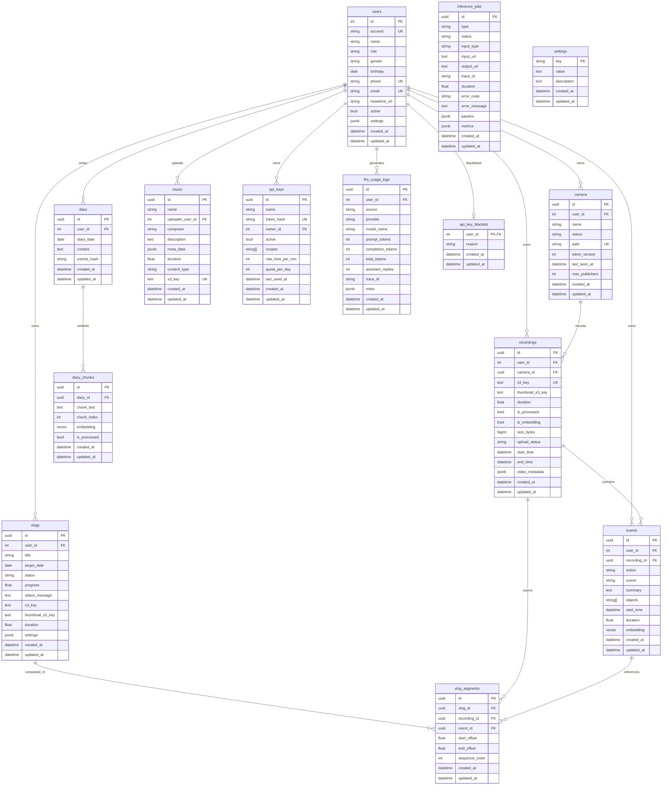

## 5. 資料設計

### 5.0 本章目的說明
本章說明「回憶拾光」的資料設計，包含資料庫系統選型、資料表結構、資料關聯與一致性管理策略，使資料層設計能對應到實際 ORM 定義（`services/APIServer/app/DataAccess/tables/*.py`）與系統資料流（錄影→事件→日記→回憶短片→查詢）。

### 5.0 本章涵蓋範圍
- **資料庫系統概述**：PostgreSQL（含 pgvector）、MinIO（物件儲存）、Redis（佇列/快取）
- **ERD（Mermaid）**：資料表與關聯
- **資料表結構定義**：逐表欄位/型別/PK/FK/索引/約束
- **資料關聯說明**：基數、可選性、刪除策略
- **資料管理與一致性考量**：DB/MinIO 一致性、冪等、任務狀態、時區

---

### 5.1 資料庫概述

#### 5.1.1 PostgreSQL（含 pgvector）
- **用途**：保存結構化資料與任務追蹤。
- **資料表來源**：`services/APIServer/app/DataAccess/tables/*.py`
- **向量欄位（pgvector）**：
  - `events.embedding`：Vector(1024)
  - `diary_chunks.embedding`：Vector(1024)
- **時間欄位策略**：
  - `TimestampMixin.created_at` 由 DB 以 UTC 產生；`updated_at` 於更新時由 DB 端更新為 UTC。
  - 業務時間（例如 event.start_time、recording.start_time）亦以 timezone-aware datetime 儲存。

#### 5.1.2 MinIO（S3 相容物件儲存）
- **用途**：保存大型媒體檔案（影片切片、縮圖、回憶短片、音樂）。
- **對照來源**：
  - Streaming uploader 產生的錄影物件 key（可驗證：`services/StreamingServer/app/uploader_worker.py`）
  - APIServer 產生 presigned URL（可驗證：`services/APIServer/app/router/Recordings/service.py`、`services/APIServer/app/router/Vlogs/service.py`、`services/APIServer/app/router/Music/service.py`）
- **典型 object key 規則（摘要）**：
  - 錄影切片：`{user_id}/videos/{camera_id}/{Y}/{m}/{d}/{YYYYmmddTHHMMSSZ}.mp4`
  - 錄影縮圖：`{user_id}/video_thumbnails/{basename}.jpg`
  - 回憶短片：`{user_id}/vlogs/{YYYYmmddTHHMMSSZ}_{vlog_id}.mp4`
  - 回憶短片縮圖：`{user_id}/vlog_thumbnails/{YYYYmmddTHHMMSSZ}_{vlog_id}.jpg`
  - 音樂：`{user_id}/music/{uuid}.{ext}`

#### 5.1.3 Redis（佇列/快取）
- **用途**：Celery broker / result backend（依環境設定）。
- **對照來源**：`services/ComputeServer/app/main.py`（BROKER_URL/RESULT_BACKEND）

---

### 5.2 資料表結構定義
> 下列欄位定義以 ORM 為準（可驗證：`services/APIServer/app/DataAccess/tables/*.py`）。型別以「SQL 概念型別」描述，實際由 SQLAlchemy/PG dialect 對應。

#### 5.2.1 `users`
- **PK**：`id` (int, auto-increment)
- **主要欄位**：
  - `account` (varchar(50), unique, index)
  - `name` (varchar(100))
  - `role` (enum: user/admin)
  - `gender` (enum: male/female)
  - `birthday` (date)
  - `phone` (varchar(20), unique, index)
  - `email` (varchar(100), unique, index)
  - `headshot_url` (text, nullable)
  - `password_hash` (varchar(256))
  - `active` (bool)
  - `settings` (jsonb, nullable)
  - `created_at/updated_at` (timestamptz)

#### 5.2.2 `camera`
- **PK**：`id` (uuid)
- **FK**：`user_id` → `users.id` (index)
- **主要欄位**：
  - `name` (varchar(128))
  - `status` (enum: inactive/active/deleted, index)
  - `path` (varchar(64), unique, index, nullable)
  - `token_version` (int)
  - `last_seen_at` (timestamptz, nullable)
  - `max_publishers` (int)
  - `created_at/updated_at`

#### 5.2.3 `recordings`
- **PK**：`id` (uuid)
- **FK**：
  - `user_id` → `users.id`
  - `camera_id` → `camera.id`（nullable）
- **唯一性**：`s3_key` unique
- **主要欄位**：
  - `s3_key` (text)
  - `thumbnail_s3_key` (text, nullable)
  - `duration` (float, nullable)
  - `is_processed` (bool)
  - `is_embedding` (bool)
  - `size_bytes` (bigint, nullable)
  - `upload_status` (enum: pending/success/failed)
  - `start_time/end_time` (timestamptz, nullable)
  - `video_metadata` (jsonb, nullable)
  - `created_at/updated_at`

#### 5.2.4 `events`
- **PK**：`id` (uuid)
- **FK**：
  - `user_id` → `users.id` (index)
  - `recording_id` → `recordings.id`（nullable, index）
- **主要欄位**：
  - `action` (varchar(128), nullable)
  - `scene` (varchar(128), nullable)
  - `summary` (text, nullable)
  - `objects` (varchar[]/array, nullable)
  - `start_time` (timestamptz, nullable)
  - `duration` (float, nullable)
  - `embedding` (vector(1024), nullable)
  - `created_at/updated_at`

#### 5.2.5 `diary`
- **PK**：`id` (uuid)
- **FK**：`user_id` → `users.id` (index)
- **主要欄位**：
  - `diary_date` (date, index)
  - `content` (text, nullable)
  - `events_hash` (varchar(64), nullable, index)
  - `created_at/updated_at`

#### 5.2.6 `diary_chunks`
- **PK**：`id` (uuid)
- **FK**：`diary_id` → `diary.id` (index, ondelete=cascade)
- **主要欄位**：
  - `chunk_text` (text)
  - `chunk_index` (int)
  - `embedding` (vector(1024), nullable)
  - `is_processed` (bool)
  - `created_at/updated_at`

#### 5.2.7 `vlogs`
- **PK**：`id` (uuid)
- **FK**：`user_id` → `users.id` (index)
- **主要欄位**：
  - `title` (varchar(255), nullable)
  - `target_date` (date)
  - `status` (varchar(50))  
  - `progress` (float)
  - `status_message` (text, nullable)
  - `s3_key` (text, nullable)
  - `thumbnail_s3_key` (text, nullable)
  - `duration` (float, nullable)
  - `settings` (jsonb, nullable)
  - `created_at/updated_at`

#### 5.2.8 `vlog_segments`
- **PK**：`id` (uuid)
- **FK**：
  - `vlog_id` → `vlogs.id` (index, ondelete=cascade)
  - `recording_id` → `recordings.id`
  - `event_id` → `events.id`（nullable）
- **主要欄位**：
  - `start_offset` (float)
  - `end_offset` (float)
  - `sequence_order` (int)
  - `created_at/updated_at`

#### 5.2.9 `inference_jobs`
- **PK**：`id` (uuid)
- **主要欄位**：
  - `type` (varchar(128))
  - `status` (enum: pending/processing/success/failed)
  - `input_type` (varchar(128))
  - `input_url` (text, nullable)
  - `output_url` (text, nullable)
  - `trace_id` (varchar(64), index, nullable)
  - `duration` (float, nullable)
  - `error_code` (varchar(64), nullable)
  - `error_message` (text, nullable)
  - `params` (jsonb, nullable)
  - `metrics` (jsonb, nullable)
  - `created_at/updated_at`

#### 5.2.10 `music`
- **PK**：`id` (uuid)
- **FK**：`uploader_user_id` → `users.id` (index)
- **唯一性**：`s3_key` unique
- **主要欄位**：
  - `name` (varchar(255))
  - `composer` (varchar(255), nullable)
  - `description` (text, nullable)
  - `meta_data` (jsonb, nullable)
  - `duration` (float, nullable)
  - `content_type` (varchar(100), nullable)
  - `s3_key` (text)
  - `created_at/updated_at`

#### 5.2.11 `api_keys`
- **PK**：`id` (uuid)
- **FK**：`owner_id` → `users.id`
- **唯一性**：`token_hash` unique (index)
- **主要欄位**：
  - `name` (varchar(100))
  - `active` (bool)
  - `scopes` (varchar[]/array, nullable)
  - `rate_limit_per_min` (int, nullable)
  - `quota_per_day` (int, nullable)
  - `last_used_at` (timestamptz, nullable)
  - `created_at/updated_at`

#### 5.2.12 `api_key_blacklist`
- **PK**：`user_id` (int, unique, index)
- **FK**：`user_id` → `users.id` (ondelete=cascade)
- **主要欄位**：
  - `reason` (varchar(500), nullable)
  - `created_at/updated_at`

#### 5.2.13 `settings`
- **PK**：`key` (varchar(100), unique, index)
- **主要欄位**：
  - `value` (text；以 JSON 字串保存)
  - `description` (text, nullable)
  - `created_at/updated_at`

#### 5.2.14 `llm_usage_logs`
- **PK**：`id` (uuid)
- **FK**：`user_id` → `users.id` (index, ondelete=cascade)
- **主要欄位**：
  - `source` (varchar(32), index；chat/diary/compute)
  - `provider` (varchar(32), nullable, index)
  - `model_name` (varchar(128), nullable, index)
  - `prompt_tokens/completion_tokens/total_tokens` (int)
  - `assistant_replies` (int)
  - `trace_id` (varchar(64), nullable, index)
  - `meta` (jsonb, nullable)
  - `created_at/updated_at`

---

### 5.3 資料關聯說明（含 ERD）

#### 5.3.1 ERD（Mermaid）

#### 5.3.2 關聯語意摘要
- `users` 為多數業務資料的擁有者（1 對多）：camera/recordings/events/diary/vlogs/music/api_keys/llm_usage_logs。
- `camera` 與 `recordings`：一個 camera 可產生多段 recordings。
- `recordings` 與 `events`：一段 recordings 可包含多個事件（事件可為 0..*）。
- `diary` 與 `diary_chunks`：一篇日記可切分為多個 chunk；chunk 以 `diary_id` 連回日記主體（ondelete=cascade）。
- `vlogs` 與 `vlog_segments`：一支回憶短片由多段 segments 組成；每段 segment 引用來源 recording 與（可選）event。
- `api_key_blacklist`：以 user_id 作為 PK，表示一位使用者最多一筆黑名單狀態。

> 註：目前 ORM 狀態未包含 `daily_summaries` 資料表；日記向量化（RAG）以 `diary` / `diary_chunks` 作為主體（`diary_chunks.diary_id` → `diary.id`）。

---

### 5.4 資料管理與一致性考量

#### 5.4.1 DB 與 MinIO 的一致性策略
- **錄影切片寫入順序（建議/現況對應）**：
  - Streaming uploader 先上傳 MinIO（成功後以 HEAD 確認可見），再呼叫 APIServer 建立 job 與 recordings。
  - recordings 以 `s3_key` unique 作為「去重鍵」，避免重複寫入。
- **presigned URL 的 host 一致性**：
  - 若內外網 MinIO endpoint 不同，需以「公開端點」生成 presigned URL；不可由反向代理改寫路徑或 host（會破壞簽名）。

#### 5.4.2 任務追蹤與冪等
- **任務追蹤表**：`inference_jobs`
  - 用於管理頁檢視與前端顯示進度/錯誤。
  - vlog 任務會將 job_id 存於 `vlogs.settings.job_id` 以便同步狀態。
- **冪等關鍵**：
  - `recordings.s3_key` unique：避免同一影片被建立多次。
  - S3 刪除語意本身冪等（物件不存在亦視為成功），可避免重試造成二次失敗。

#### 5.4.3 刪除與補償
- **刪除錄影**：需同時刪 MinIO 物件與 DB 記錄；若 MinIO 刪除失敗，DB 刪除仍可進行但需記錄錯誤以便人工清理。
- **刪除 Vlog**：同上；DB 端可依 FK ondelete=cascade 自動刪除 segments。

#### 5.4.4 時間與時區
- DB 內部以 UTC 儲存時間戳；查詢介面以使用者設定時區轉換日期邊界（例如將 local date 轉成 UTC 區間查詢）。
- 事件/錄影的 start_time 應視為「影片中對應的絕對時間」，以支持時間軸與自然語言查詢。
