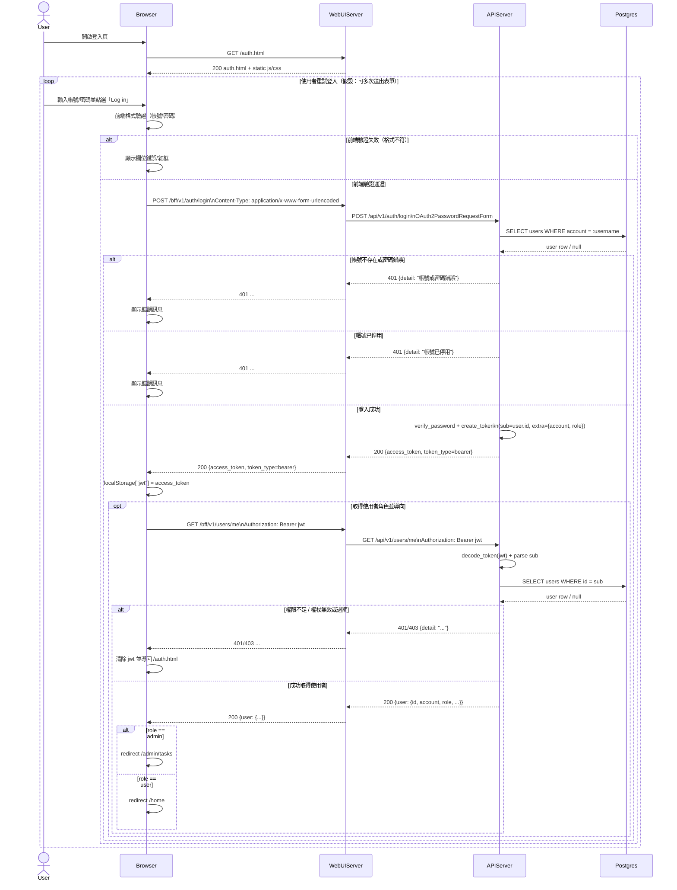

# 1-1-1 登入

# Mermaid

## Mermaid 備註
- 資料庫表：`users`
- API：Browser 呼叫 `WebUIServer` 的 `/bff/v1/auth/login`（BFF proxy），由 `WebUIServer` 轉送至 `APIServer` 的 `/api/v1/auth/login`；登入成功後前端會再呼叫 `/bff/v1/users/me` 取得 role 以決定導向頁面。
- Token：`access_token`（JWT；預設 60 分鐘；payload 含 `sub`(user.id)、`account`、`role`）
- 錯誤處理：
  - 401：帳號或密碼錯誤、帳號已停用、token 無效/過期
  - 403：帳號未啟用（`/users/me`）
  - 404：使用者不存在（`/users/me`；依後端目前實作）
- 缺少的關鍵資訊（以合理假設補齊）：
  - UI 入口網址：系統同時提供 `/`、`/auth`、`/auth.html`；本圖假設使用者由 `/auth.html` 進入。
  - 重試/鎖定/節流：程式未見登入失敗鎖定或節流；本圖假設可無限次重試。
- 假設：
  - 使用者可重複送出表單（重試）。
