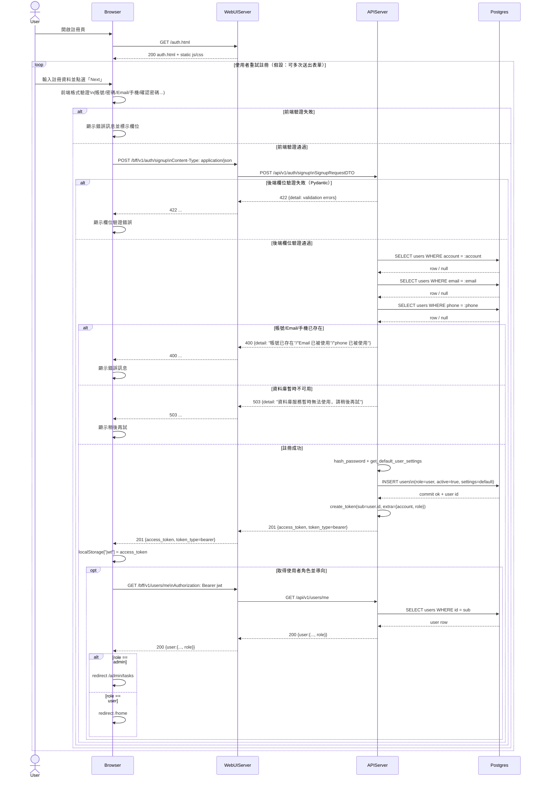

# 1-1-2 註冊

# Mermaid

## Mermaid 備註
- 資料庫表：`users`
- API：Browser 呼叫 `WebUIServer` 的 `/bff/v1/auth/signup`（BFF proxy），由 `WebUIServer` 轉送至 `APIServer` 的 `/api/v1/auth/signup`。
- 建立資料：後端檢查 account/email/phone 唯一性、bcrypt 雜湊密碼、寫入預設 `settings`、role=user、active=true。
- Token：註冊成功即回傳 `access_token`（JWT）；前端儲存後會再呼叫 `/bff/v1/users/me` 以決定導向。
- 錯誤處理：
  - 400：帳號已存在 / Email 已被使用 / phone 已被使用（或 DB 唯一鍵衝突）
  - 422：欄位驗證失敗（Pydantic 驗證）
  - 503：資料庫服務暫時無法使用
  - 500：其他未預期錯誤
- 缺少的關鍵資訊（以合理假設補齊）：
  - UI 入口網址：系統同時提供 `/`、`/auth`、`/auth.html`；本圖假設使用者由 `/auth.html` 進入。
  - Email/手機驗證流程：程式未見 OTP/Email 驗證；本圖假設不需要驗證即可直接登入。
  - 重試/鎖定/節流：程式未見註冊節流或鎖定；本圖假設可無限次重試。
- 假設：
  - 使用者可重複送出表單（重試）。
