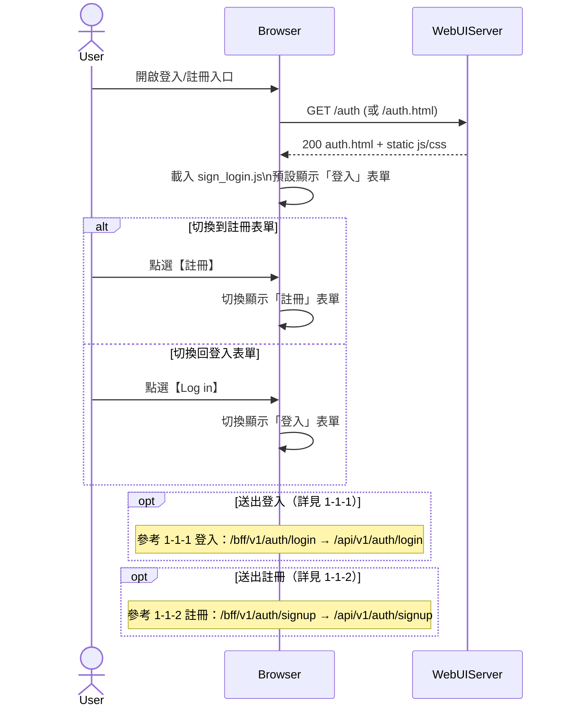

# 1-1 登入／註冊

# Mermaid

## Mermaid 備註
- UI：登入/註冊為同一頁（`auth.html`），由前端 JS 切換表單（參考 `services/WebUIServer/app/static/js/sign_login.js`）。
- 缺少的關鍵資訊：登入/註冊頁內「切換表單」的 DOM 結構與 class 切換細節未在功能描述中完整列出；本圖以「切換顯示」抽象表示（假設）。

