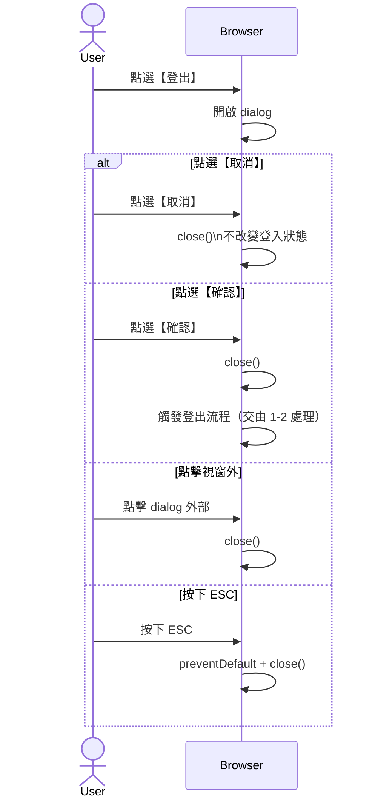

# 1-2-1 登出確認對話框

# Mermaid

## Mermaid 備註
- 此圖僅描述「確認對話框」互動；實際清除 token 與導頁見 `1-2`。
- 程式位置：`services/WebUIServer/app/template/partials/logout_confirm_dialog.html`、`services/WebUIServer/app/static/js/logout.js`。

