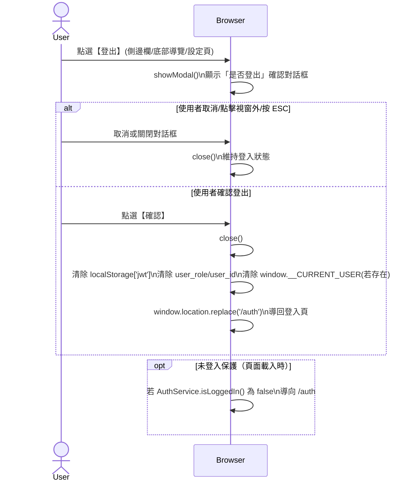

# 1-2 登出

# Mermaid

## Mermaid 備註
- 程式位置：`services/WebUIServer/app/static/js/logout.js`、`services/WebUIServer/app/static/js/AuthService.js`。
- 重要特性：登出**不呼叫後端 API**，只做前端 token/快取清除與導頁。
- 缺少的關鍵資訊：若系統未來要做「token 伺服端黑名單」或「refresh token 撤銷」，需新增後端登出端點（目前未見）（假設）。

