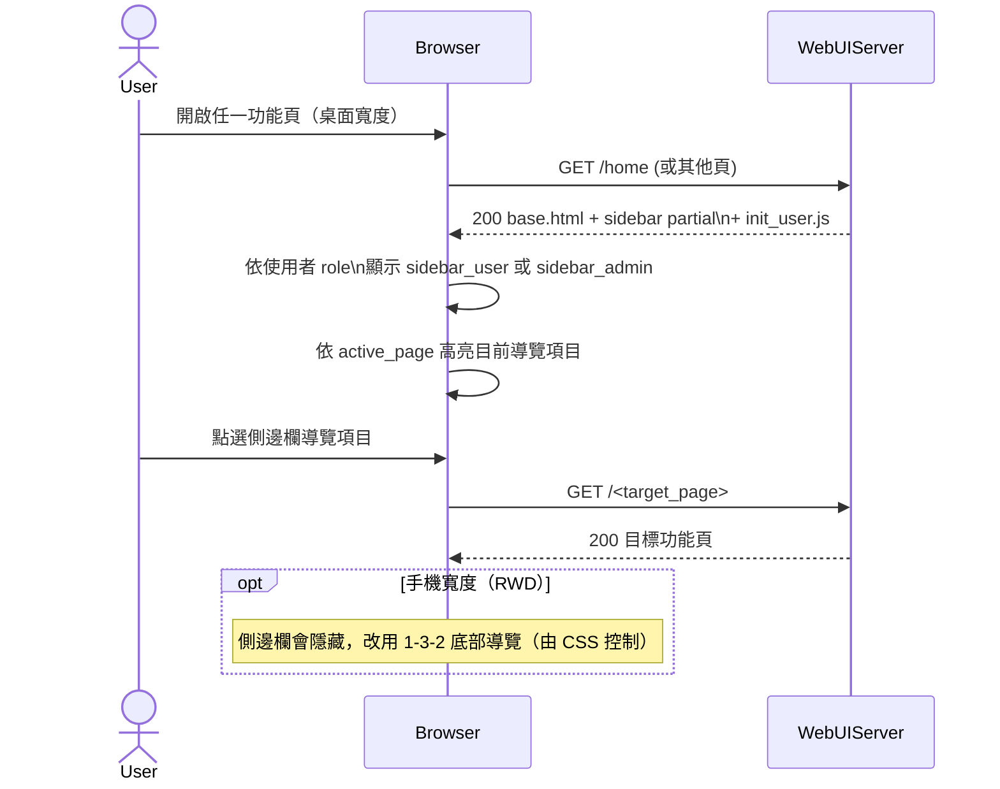

# 1-3-1 側邊欄

# Mermaid

## Mermaid 備註
- 角色切換：由 `init_user.js` 判斷 `role===admin`，切換顯示 `sidebar_admin` 或 `sidebar_user`（DOM 元素 `#sidebar-admin/#sidebar-user`）。\n- 高亮：由模板 `active_page`（`body.dataset.activePage`）與 CSS 決定（抽象表示）。\n- 登出：側邊欄的登出按鈕會觸發 1-2/1-2-1。\n+

