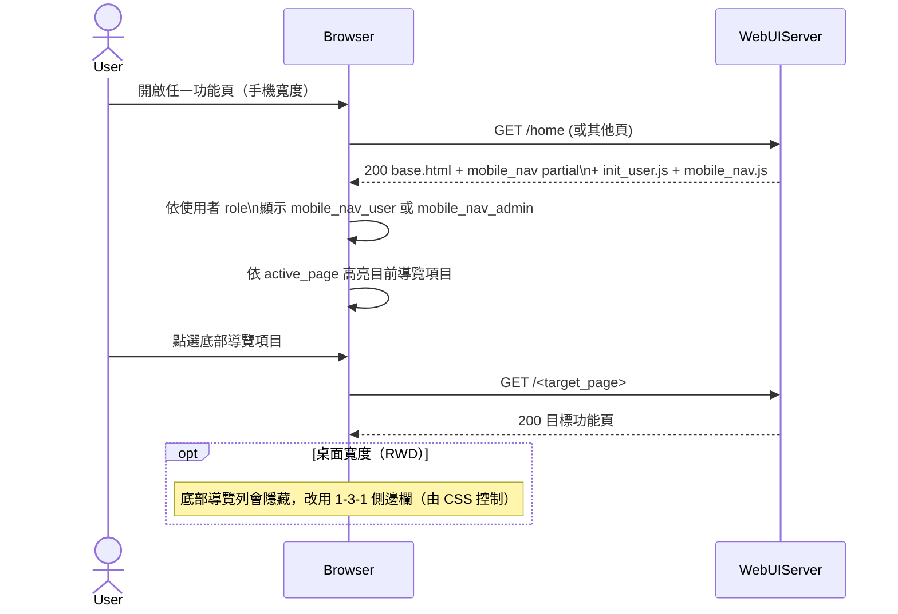

# 1-3-2 行動版底部導覽

# Mermaid

## Mermaid 備註
- 角色切換：由 `init_user.js` 判斷 `role===admin`，切換顯示 `mobile_nav_admin` 或 `mobile_nav_user`。\n- 高亮：由 `mobile_nav.js`/模板 `active_page` 與 CSS 決定（抽象表示）。\n- 登出：行動版登出按鈕會觸發 1-2/1-2-1。\n+

