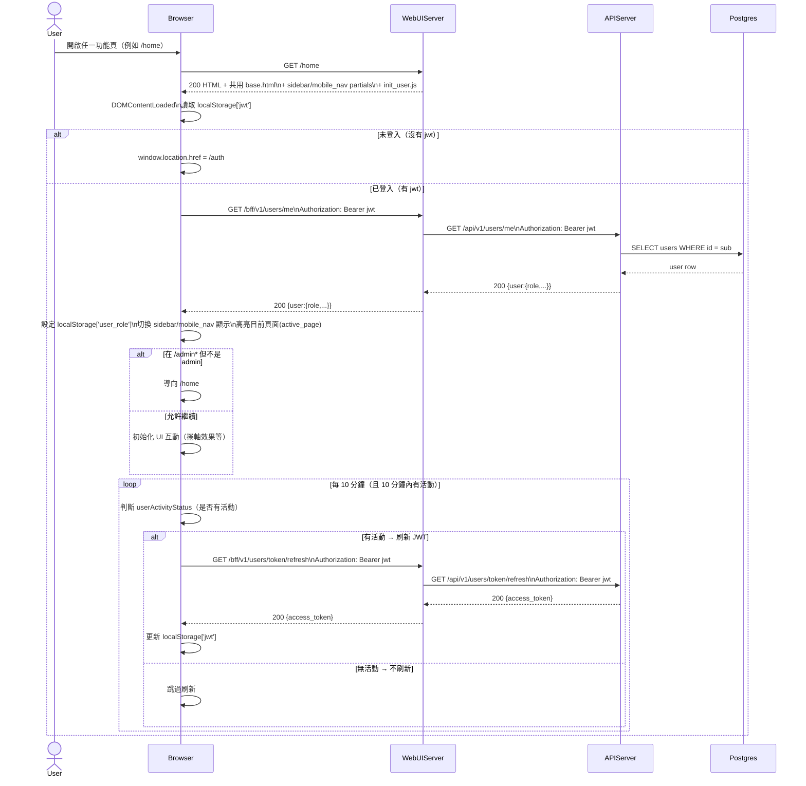

# 1-3 導覽與版面

# Mermaid

## Mermaid 備註
- 使用者資訊：由前端呼叫 `/bff/v1/users/me`（BFF）取得 role，並依 `role===admin` 切換 `sidebar_admin`/`mobile_nav_admin`（參考 `services/WebUIServer/app/static/js/init_user.js`）。\n- JWT 刷新：前端每 10 分鐘檢查活動狀態，若有活動則呼叫 `/bff/v1/users/token/refresh` 取得新 token（參考 `services/APIServer/app/router/User/service.py` 的 `/token/refresh`）。\n- 缺少的關鍵資訊：\n  - 後端 JWT 刷新是否會延長過期時間、以及是否有 refresh token/blacklist 機制（目前未見）（假設：單純重新簽發 access_token）。\n  - 導覽高亮的具體實作依賴 template 的 `active_page` 與 CSS（本圖抽象為「高亮目前頁面」）。\n+

