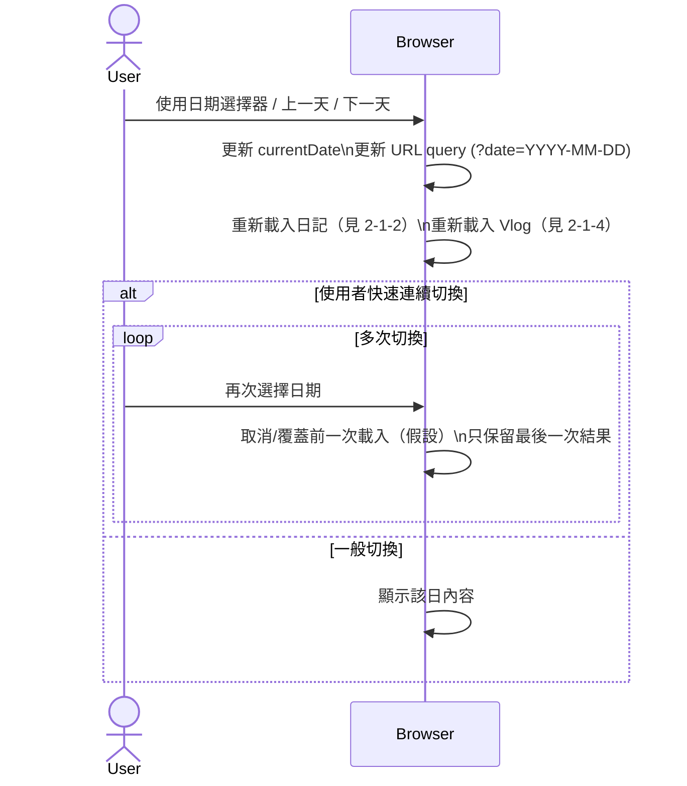

# 2-1-1 切換日期

# Mermaid

## Mermaid 備註
- 入口：`diary.js` 綁定 `#diaryDate` change 與翻頁區塊 click，會同步更新日記與 Vlog（`window.vlogManager.loadDailyVlog()`）。\n- 缺少的關鍵資訊：前端是否做「請求取消/去抖動」避免重複載入（程式未明確使用 AbortController）；本圖以「覆蓋前一次結果」（假設）表達。\n+

