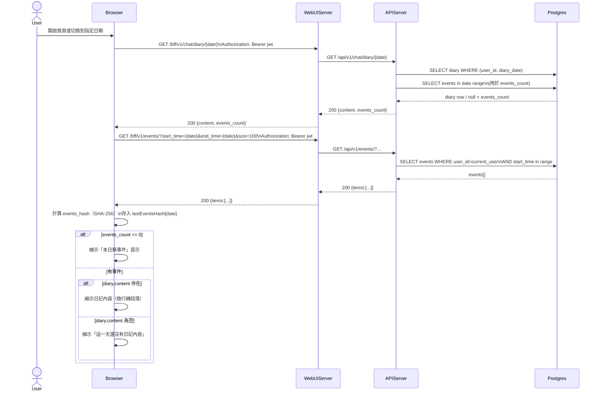

# 2-1-2 顯示日記內容

# Mermaid

## Mermaid 備註
- 前端會額外查詢事件列表並在瀏覽器端計算 `events_hash`，用於後續自動刷新判斷（參考 `services/WebUIServer/app/static/js/diary.js`）。\n- 後端日記查詢：`GET /api/v1/chat/diary/{diary_date}`（不會強制刷新）。\n- 缺少的關鍵資訊：事件列表 `events` 查詢參數命名與排序規則由 `Events` router 決定；本圖以 `start_time/end_time/size` 抽象表示。\n+

