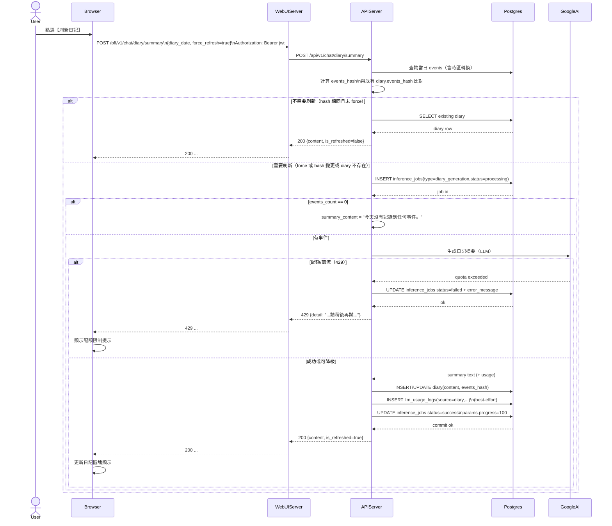

# 2-1-3 生成／刷新日記

# Mermaid

## Mermaid 備註
- API：前端使用 `ApiClient.chat.generateDiarySummary(diaryDate, true)` → `POST /bff/v1/chat/diary/summary`。\n- 後端行為（依程式碼）：會建立 `inference_jobs` 追蹤（`diary_generation`），並在成功時寫入 `diary`；LLM 配額錯誤會回 `429`。\n- 缺少的關鍵資訊：GoogleAI 供應商/模型的選擇邏輯受「使用者設定/系統預設」影響；本圖以 `GoogleAI` 抽象代表外部 LLM（假設：使用 Gemini）。\n+

