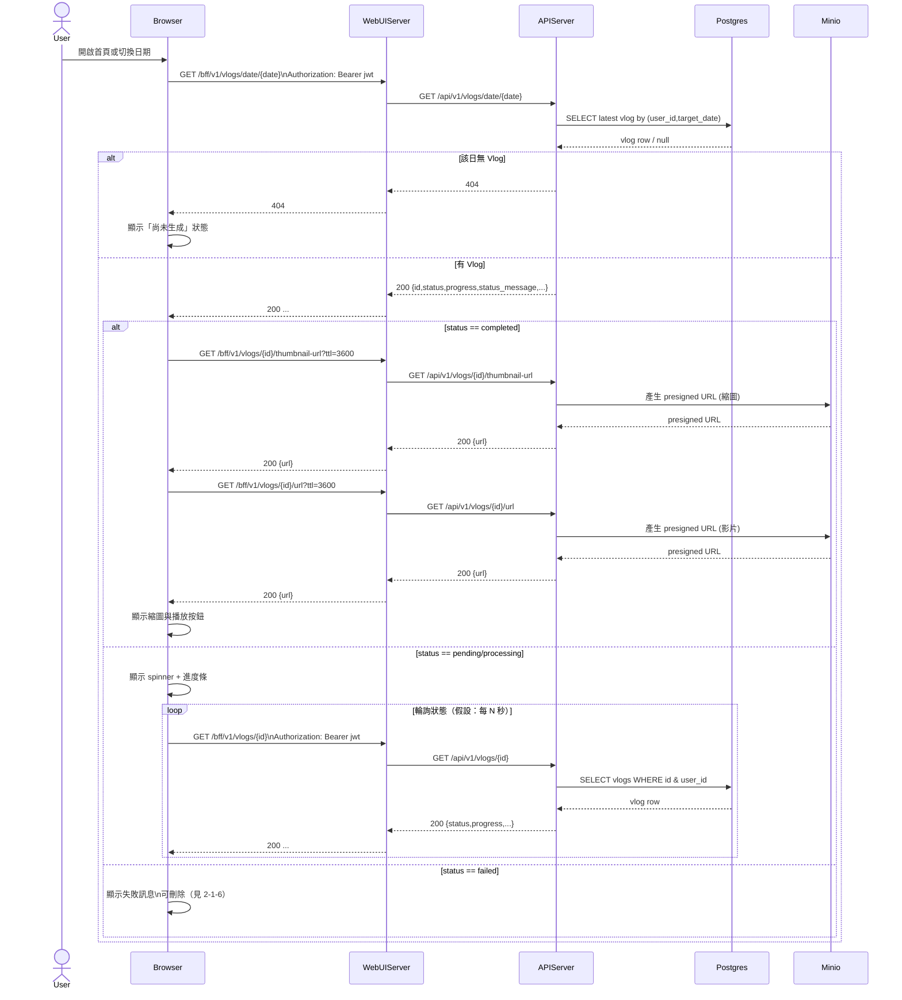

# 2-1-4 顯示當日 Vlog

# Mermaid

## Mermaid 備註
- API：`GET /bff/v1/vlogs/date/{date}`、輪詢 `GET /bff/v1/vlogs/{id}`；完成後用 `GET /bff/v1/vlogs/{id}/url`、`GET /bff/v1/vlogs/{id}/thumbnail-url`。\n- 播放/縮圖 URL：由後端產生 MinIO 預簽名 URL（`generate_presigned_url`）。\n- 缺少的關鍵資訊：輪詢間隔與停止條件由 `vlog.js` 控制；本圖以「每 N 秒」表示（假設）。\n+

