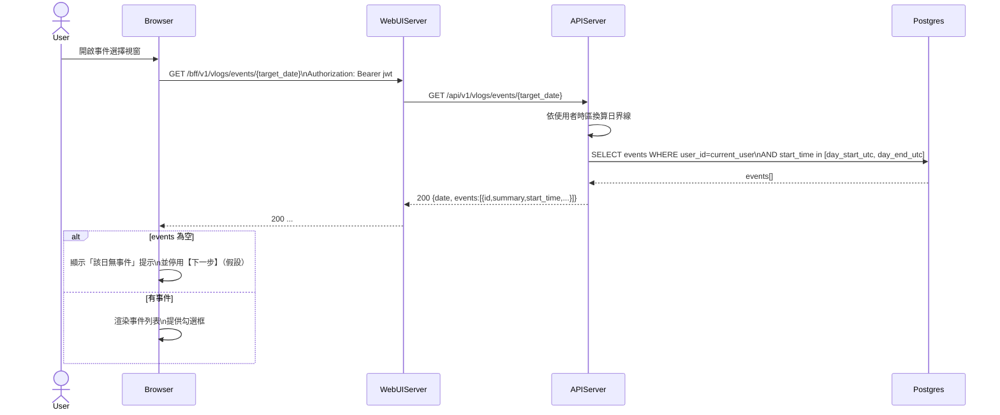

# 2-1-5-1 載入指定日期事件清單

# Mermaid

## Mermaid 備註
- API：`GET /bff/v1/vlogs/events/{date}` → `GET /api/v1/vlogs/events/{date}`。\n- 後端會依「使用者時區」計算當日 UTC 區間再查詢 events。\n- 缺少的關鍵資訊：前端 UI 對「無事件」的互動限制（是否可直接進下一步）未在描述中固定；本圖假設無事件時不可進入參數設定。\n+

