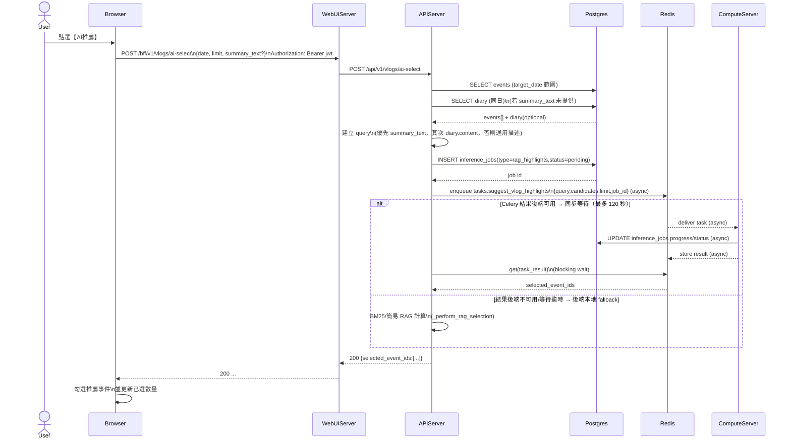

# 2-1-5-2 AI 推薦事件

# Mermaid

## Mermaid 備註
- API：`POST /bff/v1/vlogs/ai-select`。\n- 後端實作特性：會建立 `inference_jobs`（`rag_highlights`），並嘗試以 Celery 同步等待結果；若無結果後端或逾時，則在 APIServer 端以 BM25 fallback 計算。\n- 缺少的關鍵資訊：ComputeServer 任務 `tasks.suggest_vlog_highlights` 的具體 scoring/embedding 行為不在本圖細化；以「回傳 selected_event_ids」抽象表示。\n+

