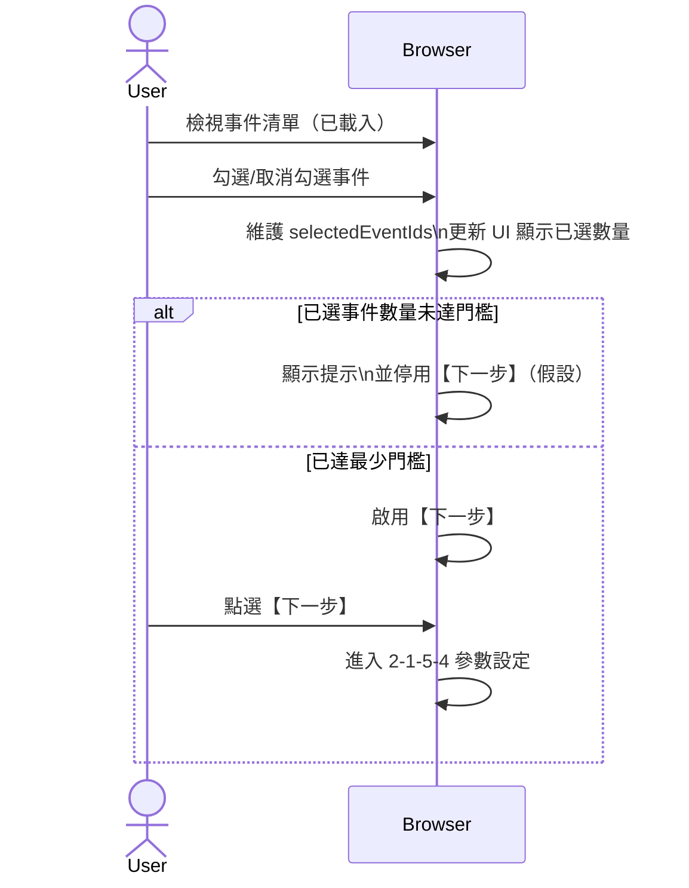

# 2-1-5-3 手動勾選事件片段

# Mermaid

```mermaid
sequenceDiagram
  actor User
  participant Browser

  User ->> Browser: 檢視事件清單（已載入）
  User ->> Browser: 勾選/取消勾選事件
  Browser ->> Browser: 維護 selectedEventIds\n更新 UI 顯示已選數量

  alt 已選事件數量未達門檻
    Browser ->> Browser: 顯示提示\n並停用【下一步】（假設）
  else 已達最少門檻
    Browser ->> Browser: 啟用【下一步】
    User ->> Browser: 點選【下一步】
    Browser ->> Browser: 進入 2-1-5-4 參數設定
  end
```

## Mermaid 備註
- 此功能為前端互動邏輯，無需呼叫後端。\n- 缺少的關鍵資訊：最少事件數量門檻值與錯誤提示文案未在功能描述中固定；本圖僅表達「達門檻才可下一步」（假設）。\n+

