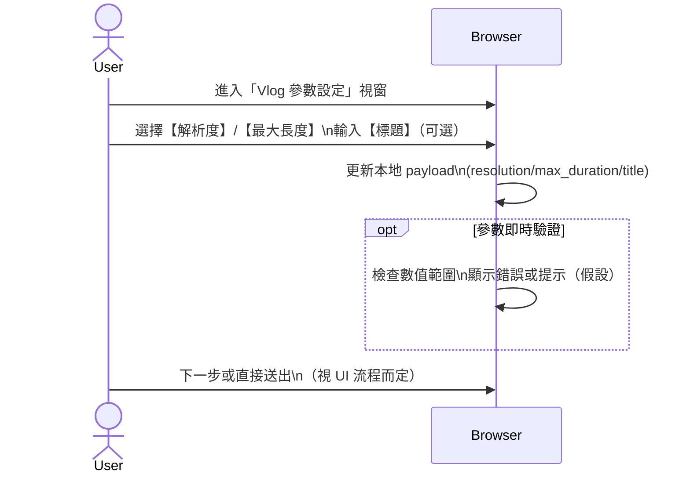

# 2-1-5-4 Vlog 參數設定

# Mermaid

```mermaid
sequenceDiagram
  actor User
  participant Browser

  User ->> Browser: 進入「Vlog 參數設定」視窗
  User ->> Browser: 選擇【解析度】/【最大長度】\n輸入【標題】（可選）
  Browser ->> Browser: 更新本地 payload\n(resolution/max_duration/title)

  opt 參數即時驗證
    Browser ->> Browser: 檢查數值範圍\n顯示錯誤或提示（假設）
  end

  User ->> Browser: 下一步或直接送出\n（視 UI 流程而定）
```

## Mermaid 備註
- 本功能主要為前端設定 payload，真正生效在 `2-1-5-6 送出生成任務` 的 `POST /vlogs`。\n- 缺少的關鍵資訊：解析度選項集合、max_duration 上下限與預設值在 JSON 僅描述概念；本圖不硬編常數（假設）。\n+

