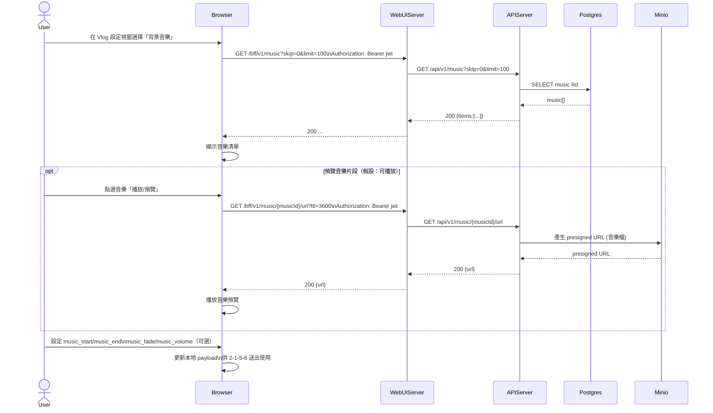

# 2-1-5-5 背景音樂設定

# Mermaid

## Mermaid 備註
- 音樂清單：`GET /bff/v1/music`；音樂播放 URL：`GET /bff/v1/music/{id}/url`（MinIO 預簽名 URL）。\n- 缺少的關鍵資訊：前端是否提供「裁切範圍 UI（start/end）」與其單位/範圍限制；本圖以 payload 欄位抽象表示（假設：秒）。\n+

