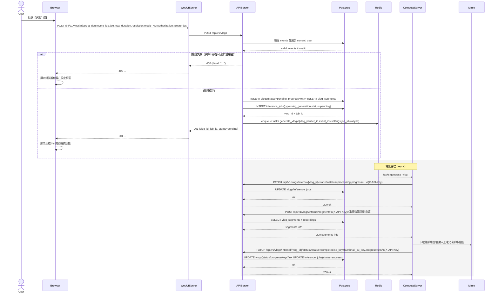

# 2-1-5-6 送出生成任務

# Mermaid

## Mermaid 備註
- 建立任務：`POST /vlogs` 會先建立 `vlogs/vlog_segments/inference_jobs`，再 enqueue `tasks.generate_vlog` 到 Redis。\n- 背景更新：ComputeServer 透過 M2M（`X-API-Key`）回打 `/vlogs/internal/{id}/status` 更新進度與結果。\n- 缺少的關鍵資訊：前端輪詢使用哪個端點（`/vlogs/date/{date}` 或 `/vlogs/{id}`）與間隔未固定；本圖以「輪詢狀態」抽象表示。\n+

