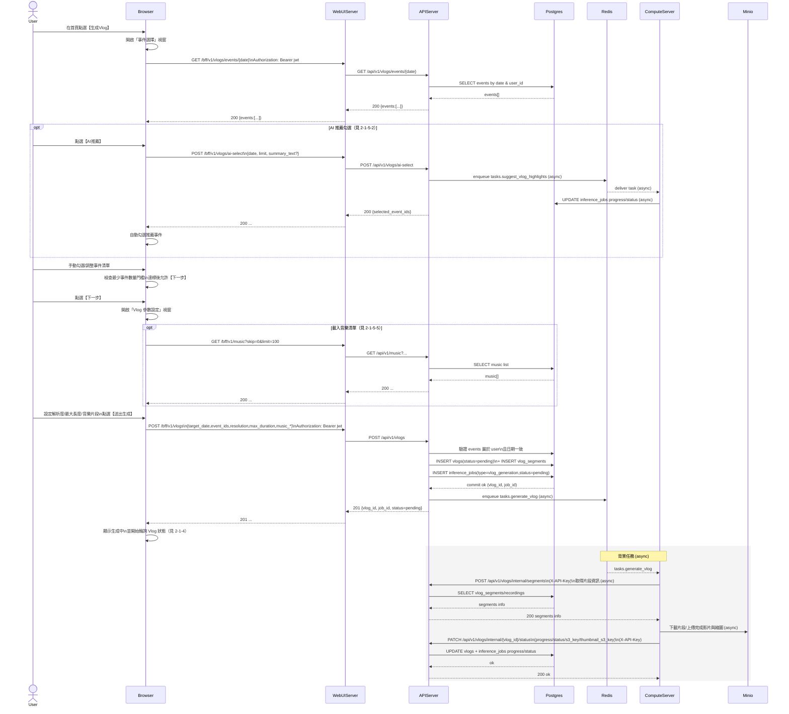

# 2-1-5 生成 Vlog

# Mermaid

## Mermaid 備註
- 前端主流程：事件選擇（載入/AI推薦/手動）→ 參數設定（含音樂）→ 送出生成。\n- 後端主流程：`POST /vlogs` 建立 `vlogs/vlog_segments/inference_jobs`，再透過 Celery enqueue 到 **Redis**，由 **ComputeServer** worker 生成並回寫狀態。\n- 缺少的關鍵資訊：ComputeServer 實際下載來源（錄影片段在 MinIO 的 bucket/key 結構）與 FFmpeg 處理細節在此圖以「下載片段/上傳影片」抽象表示（假設）。\n+

