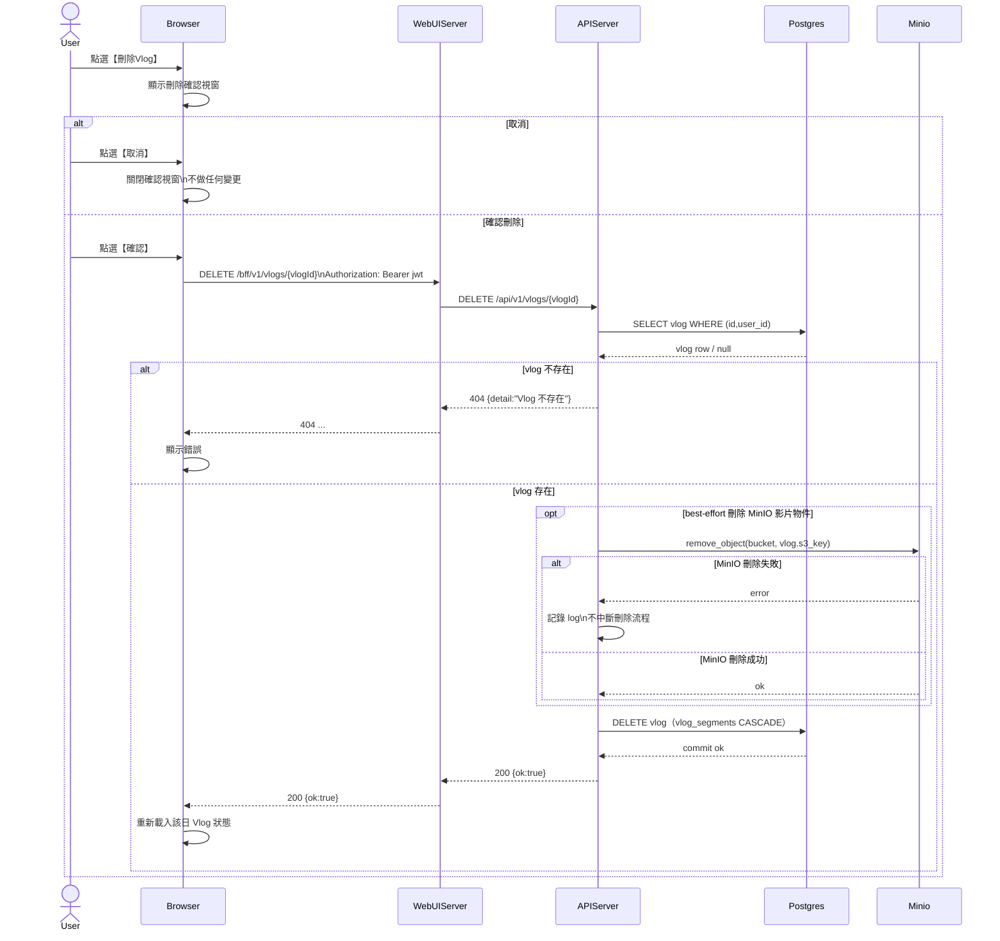

# 2-1-6 刪除當日 Vlog

# Mermaid

## Mermaid 備註
- API：`DELETE /bff/v1/vlogs/{vlogId}`。\n- 後端實作：先 best-effort 刪除 MinIO 物件，再刪除 `vlogs` 記錄；`vlog_segments` 依 DB 關聯 CASCADE 一併刪除。\n- 缺少的關鍵資訊：是否也刪除縮圖物件 `thumbnail_s3_key`（程式碼片段顯示主要刪 `s3_key`）；本圖僅畫出影片刪除（假設）。\n+

