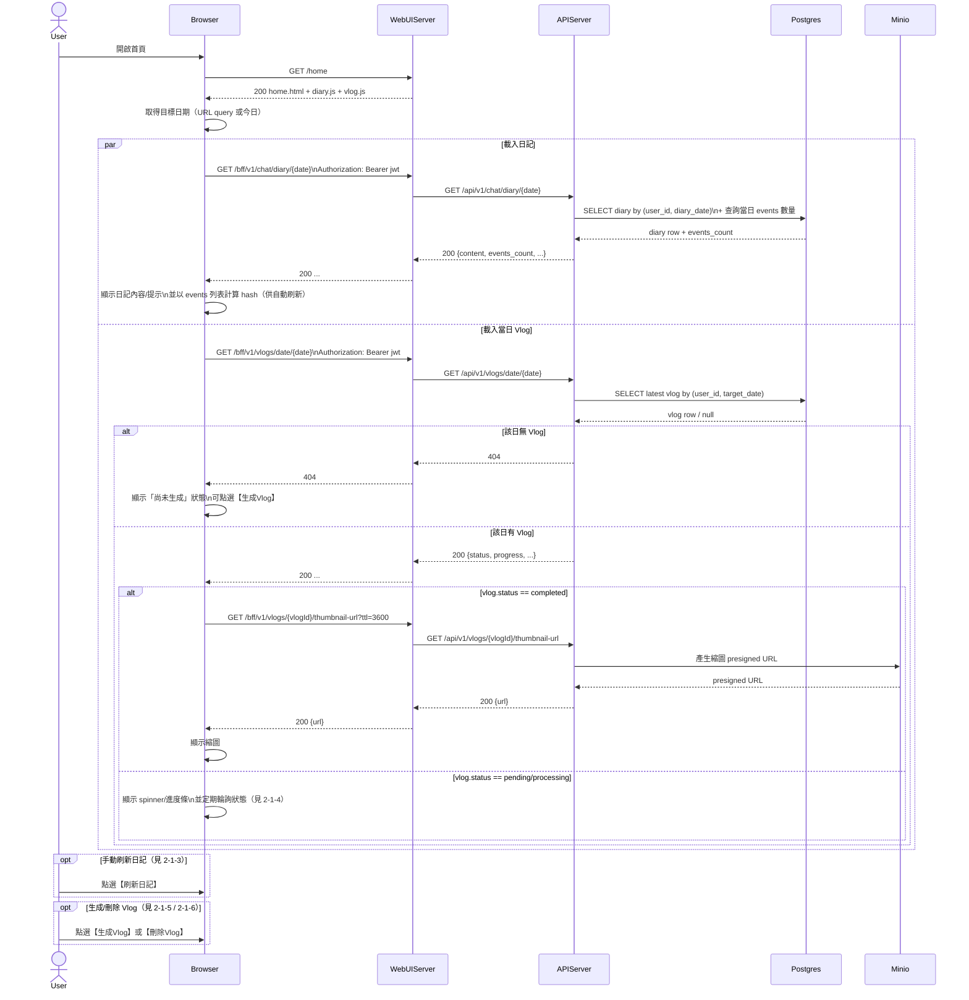

# 2-1 首頁

# Mermaid

## Mermaid 備註
- 首頁主要由 `home.html` 搭配 `diary.js`/`vlog.js` 載入「指定日期」的日記與 Vlog。\n- 日記 API：`GET /bff/v1/chat/diary/{date}`；刷新 API：`POST /bff/v1/chat/diary/summary`。\n- Vlog API：`GET /bff/v1/vlogs/date/{date}`，完成後用 `/vlogs/{id}/thumbnail-url`、`/vlogs/{id}/url` 取得預簽名 URL。\n- 缺少的關鍵資訊：首頁 `home.js` 與 `vlog.js` 的輪詢間隔/停止條件未在功能描述中固定；本圖以「定期輪詢」（假設）表示。\n+

