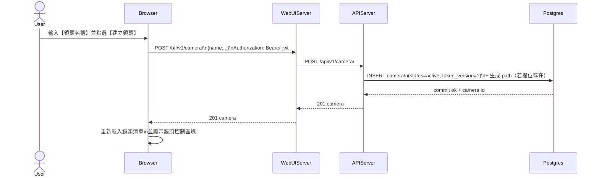

# 2-2-1 新增鏡頭

# Mermaid

## Mermaid 備註
- API：`POST /bff/v1/camera/` → `POST /api/v1/camera/`。\n- 後端：一般使用者只能建立自己的鏡頭（`user_id` 由 JWT 決定）；會在 `flush` 後以 camera UUID 派生 `path`。\n- 缺少的關鍵資訊：前端是否允許設定 max_publishers 等進階欄位；本圖以最小 `{name}` 抽象表示（假設）。\n+

