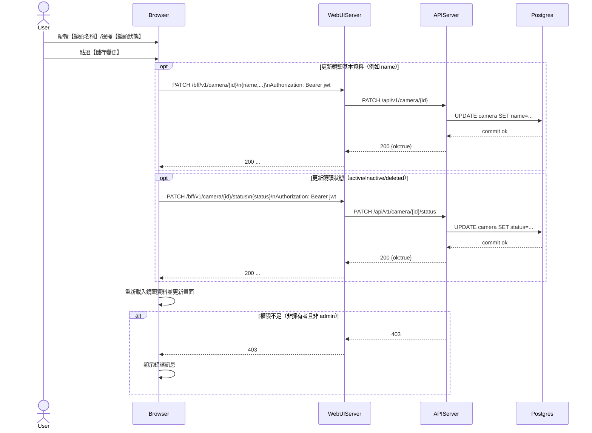

# 2-2-2 編輯鏡頭

# Mermaid

```mermaid
sequenceDiagram
  actor User
  participant Browser
  participant WebUIServer
  participant APIServer
  participant Postgres

  User ->> Browser: 編輯【鏡頭名稱】/選擇【鏡頭狀態】
  User ->> Browser: 點選【儲存變更】

  opt 更新鏡頭基本資料（例如 name）
    Browser ->> WebUIServer: PATCH /bff/v1/camera/{id}\n{name,...}\nAuthorization: Bearer jwt
    WebUIServer ->> APIServer: PATCH /api/v1/camera/{id}
    APIServer ->> Postgres: UPDATE camera SET name=...
    Postgres -->> APIServer: commit ok
    APIServer -->> WebUIServer: 200 {ok:true}
    WebUIServer -->> Browser: 200 ...
  end

  opt 更新鏡頭狀態（active/inactive/deleted）
    Browser ->> WebUIServer: PATCH /bff/v1/camera/{id}/status\n{status}\nAuthorization: Bearer jwt
    WebUIServer ->> APIServer: PATCH /api/v1/camera/{id}/status
    APIServer ->> Postgres: UPDATE camera SET status=...
    Postgres -->> APIServer: commit ok
    APIServer -->> WebUIServer: 200 {ok:true}
    WebUIServer -->> Browser: 200 ...
  end

  Browser ->> Browser: 重新載入鏡頭資料並更新畫面

  alt 權限不足（非擁有者且非 admin）
    APIServer -->> WebUIServer: 403
    WebUIServer -->> Browser: 403
    Browser ->> Browser: 顯示錯誤訊息
  end
```

## Mermaid 備註
- 後端提供兩條路徑：`PATCH /camera/{id}`（更新欄位）與 `PATCH /camera/{id}/status`（更新狀態）。\n- 權限：一般使用者只能修改自己的鏡頭；否則 403。\n+

