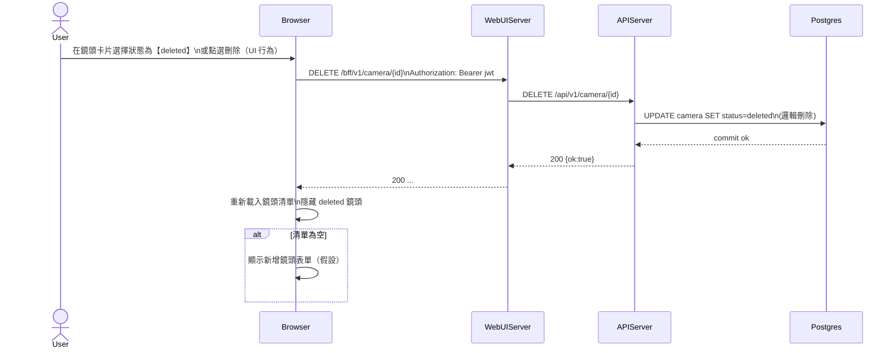

# 2-2-3 刪除鏡頭

# Mermaid

## Mermaid 備註
- 後端刪除採「邏輯刪除」：將 `camera.status` 設為 `deleted`（參考 `services/APIServer/app/router/Camera/service.py`）。\n- 缺少的關鍵資訊：前端是否用 `DELETE /camera/{id}` 或 `PATCH /camera/{id}/status` 來代表刪除；本圖以 `DELETE` 表達（若實作改用 PATCH，可視為等價）。\n+

