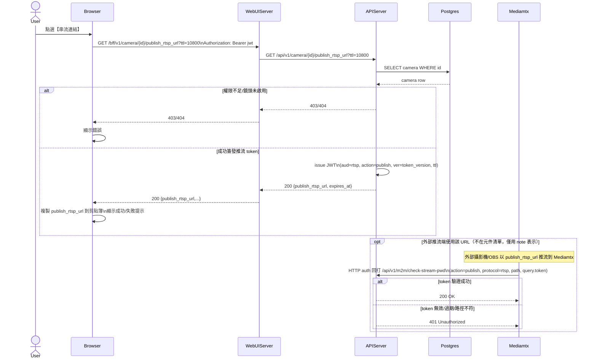

# 2-2-4 取得 RTSP 推流 URL

# Mermaid

## Mermaid 備註
- 取得推流 URL：`GET /camera/{id}/publish_rtsp_url` 會簽發短效 JWT，並將 token 以 query string 放入 RTSP URL。\n- MediaMTX 驗證：`deploy/mediamtx/mediamtx.yml` 設定 `authMethod: http`，會回打 `APIServer` 的 `/m2m/check-stream-pwd` 驗證 token。\n- 缺少的關鍵資訊：外部推流端（攝影機/OBS）不在允許 participant 清單中，因此以 note 表示。\n+

