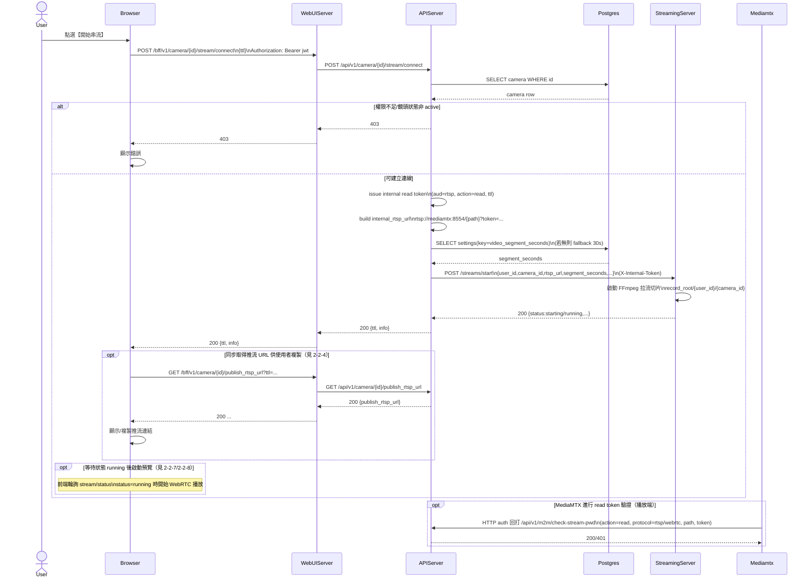

# 2-2-5 開始串流

# Mermaid

## Mermaid 備註
- 開始串流使用 `POST /camera/{id}/stream/connect`：後端簽 internal RTSP token，並呼叫 `StreamingServer /streams/start` 啟動拉流與切片錄影。\n- 推流 URL（給外部推流端）由 `GET /camera/{id}/publish_rtsp_url` 另外取得。\n- 缺少的關鍵資訊：使用者「推流端」行為不在 participant 清單，故不畫成 lifeline；僅以 note 表示。\n+

