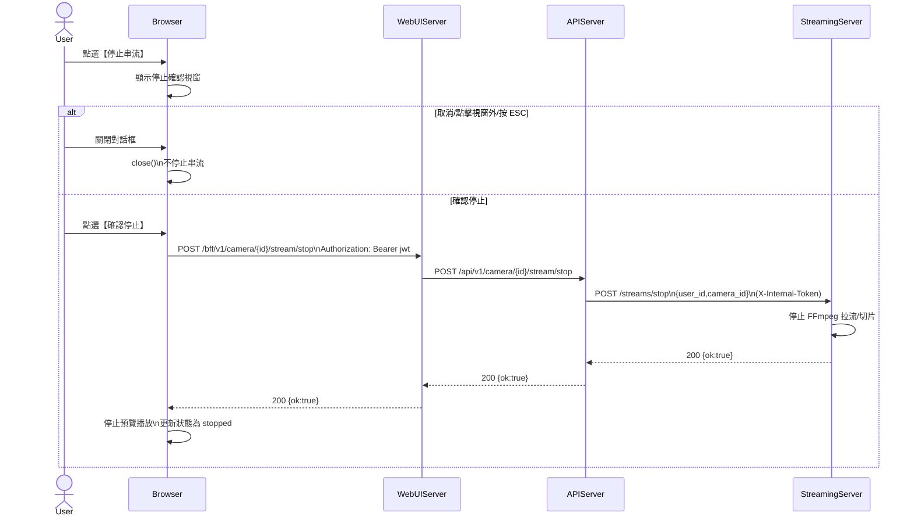

# 2-2-6 停止串流

# Mermaid

## Mermaid 備註
- 前端確認對話框模板：`services/WebUIServer/app/template/partials/stop_stream_confirm_dialog.html`。\n- 停止端點：`POST /camera/{id}/stream/stop` 由 APIServer 轉呼叫 StreamingServer `POST /streams/stop`。\n+

