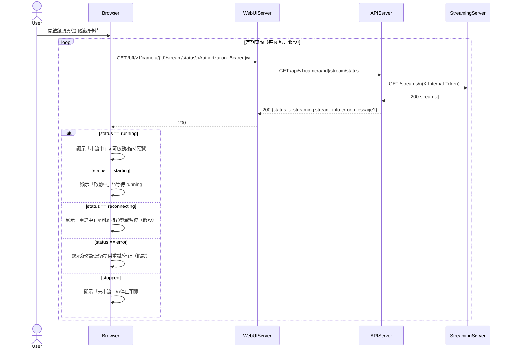

# 2-2-7 顯示串流狀態

# Mermaid

## Mermaid 備註
- APIServer 狀態彙整：實際是呼叫 `StreamingServer /streams` 找到 `(user_id,camera_id)` 對應的 stream，並回傳其 `status`。\n- StreamingServer 狀態：包含 `starting/running/reconnecting/error/stopped`（參考 `services/StreamingServer/app/manager.py`）。\n- 缺少的關鍵資訊：前端輪詢間隔 N 秒、以及「reconnecting」時是否仍維持播放器連線，屬 UI 策略；本圖以假設表示。\n+

