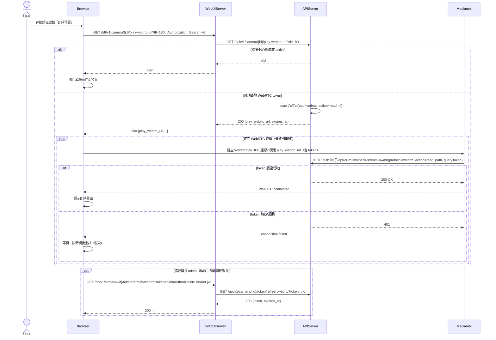

# 2-2-8 播放及時串流

# Mermaid

## Mermaid 備註
- WebRTC 播放 URL：`GET /camera/{id}/play-webrtc-url` 會簽發 `aud=webrtc` 的短效 JWT，並組成 public WebRTC 播放 URL。\n- MediaMTX 驗證：同 RTSP，透過 `authHTTPAddress` 回打 `APIServer /m2m/check-stream-pwd`。\n- 缺少的關鍵資訊：前端重連策略（退避時間、最大重試次數）未固定；本圖以「等待後重試」（假設）表示。\n+

