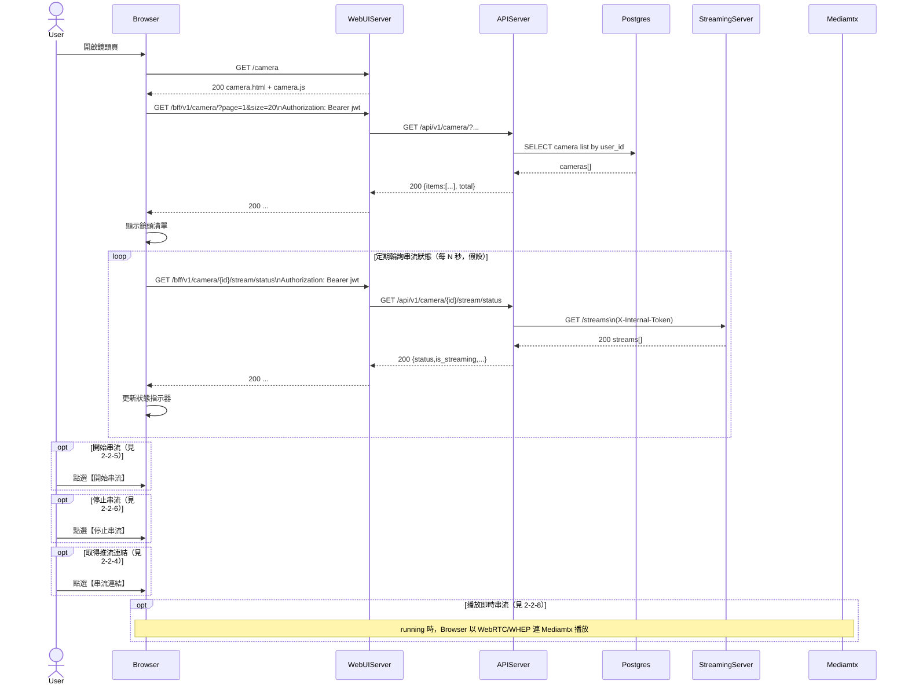

# 2-2 鏡頭串流

# Mermaid

## Mermaid 備註
- 鏡頭 CRUD：使用 `/camera` 相關 API（`APIServer` 的 `Camera` router）。\n- 串流狀態：`APIServer` 會反查 `StreamingServer /streams` 彙整狀態回給前端。\n- 即時預覽：使用 `Mediamtx` 的 WebRTC（WHEP）播放，並由 `Mediamtx` 透過 HTTP auth 回打 `APIServer` 驗證 token。\n- 缺少的關鍵資訊：前端輪詢間隔 N 秒、以及是否只輪詢「目前選取鏡頭」未在描述固定；本圖以「每 N 秒」與「camera/{id}」抽象表示。\n+

