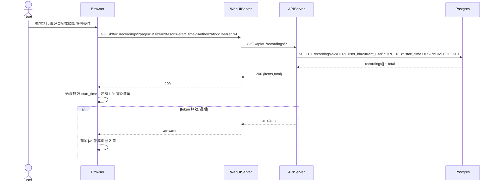

# 2-3-1 影片列表查詢

# Mermaid

## Mermaid 備註
- API：`GET /bff/v1/recordings/`（支援 `page/size/sort/start_time/end_time` 等參數）。\n- 權限：後端會以 JWT 的 current_user 限制只能查自己的錄影。\n- 缺少的關鍵資訊：`recordings.js` 的實際預設排序/過濾規則可能依 UI 狀態變化；本圖以 `sort=-start_time` 抽象表示。\n+

