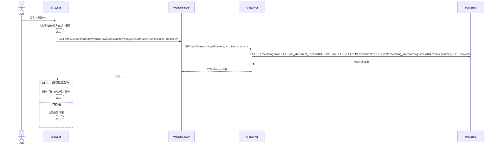

# 2-3-2 事件關鍵字搜尋

# Mermaid

```mermaid
sequenceDiagram
  actor User
  participant Browser
  participant WebUIServer
  participant APIServer
  participant Postgres

  User ->> Browser: 輸入【關鍵字】
  Browser ->> Browser: 去抖動/等待輸入完成（假設）
  Browser ->> WebUIServer: GET /bff/v1/recordings/?keywords={kw}&sr=summary&page=1&size=20\nAuthorization: Bearer jwt
  WebUIServer ->> APIServer: GET /api/v1/recordings/?keywords=...&sr=summary

  APIServer ->> Postgres: SELECT recordings\nWHERE user_id=current_user\nAND EXISTS(\n  SELECT 1 FROM events\n  WHERE events.recording_id=recordings.id\n  AND events.summary ILIKE %kw%\n)
  Postgres -->> APIServer: recordings[]
  APIServer -->> WebUIServer: 200 {items,total}
  WebUIServer -->> Browser: 200 ...

  alt 搜尋結果為空
    Browser ->> Browser: 顯示「無符合結果」提示
  else 有結果
    Browser ->> Browser: 更新錄影清單
  end
```

## Mermaid 備註
- 後端實作：使用 `exists` 子查詢在 `events` 表上做範圍比對；`sr` 可指定欄位範圍（預設查 `summary`）。\n- 缺少的關鍵資訊：前端是否在每次 keypress 即發 API、或採「按 Enter/搜尋按鈕」；本圖以「去抖動」（假設）表示。\n+

