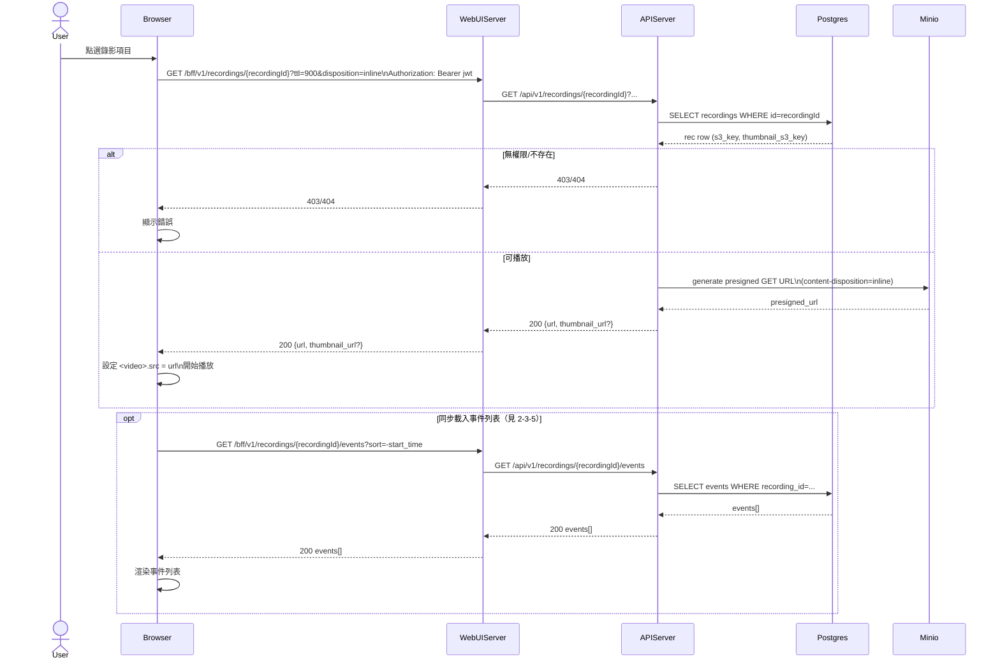

# 2-3-3 播放影片

# Mermaid

```mermaid
sequenceDiagram
  actor User
  participant Browser
  participant WebUIServer
  participant APIServer
  participant Postgres
  participant Minio

  User ->> Browser: 點選錄影項目
  Browser ->> WebUIServer: GET /bff/v1/recordings/{recordingId}?ttl=900&disposition=inline\nAuthorization: Bearer jwt
  WebUIServer ->> APIServer: GET /api/v1/recordings/{recordingId}?...

  APIServer ->> Postgres: SELECT recordings WHERE id=recordingId
  Postgres -->> APIServer: rec row (s3_key, thumbnail_s3_key)

  alt 無權限/不存在
    APIServer -->> WebUIServer: 403/404
    WebUIServer -->> Browser: 403/404
    Browser ->> Browser: 顯示錯誤
  else 可播放
    APIServer ->> Minio: generate presigned GET URL\n(content-disposition=inline)
    Minio -->> APIServer: presigned_url
    APIServer -->> WebUIServer: 200 {url, thumbnail_url?}
    WebUIServer -->> Browser: 200 {url, thumbnail_url?}
    Browser ->> Browser: 設定 <video>.src = url\n開始播放
  end

  opt 同步載入事件列表（見 2-3-5）
    Browser ->> WebUIServer: GET /bff/v1/recordings/{recordingId}/events?sort=-start_time
    WebUIServer ->> APIServer: GET /api/v1/recordings/{recordingId}/events
    APIServer ->> Postgres: SELECT events WHERE recording_id=...
    Postgres -->> APIServer: events[]
    APIServer -->> WebUIServer: 200 events[]
    WebUIServer -->> Browser: 200 events[]
    Browser ->> Browser: 渲染事件列表
  end
```

## Mermaid 備註
- 播放連結：`GET /recordings/{id}?disposition=inline` 回傳 presigned URL，支援瀏覽器以 Range 請求串流播放。\n- 回傳內容：可能同時帶 `thumbnail_url`（縮圖 presign 失敗時不影響影片）。\n+

