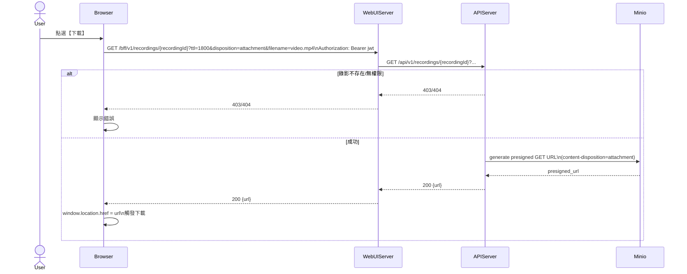

# 2-3-4 下載影片

# Mermaid

## Mermaid 備註
- 下載同樣使用 `GET /recordings/{id}`，差別在 `disposition=attachment` 與可選的 `filename`。\n- 缺少的關鍵資訊：前端實際以 `<a download>` 或 `window.open()` 觸發下載，屬 UI 實作差異；本圖以 `location.href` 抽象表示。\n+

