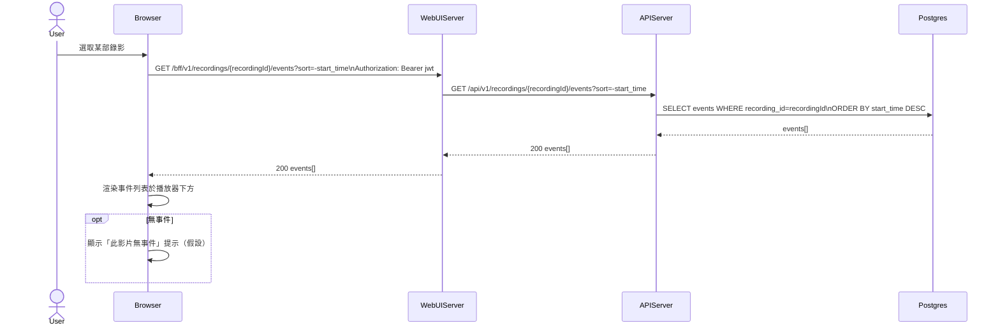

# 2-3-5 顯示影片事件列表

# Mermaid

```mermaid
sequenceDiagram
  actor User
  participant Browser
  participant WebUIServer
  participant APIServer
  participant Postgres

  User ->> Browser: 選取某部錄影
  Browser ->> WebUIServer: GET /bff/v1/recordings/{recordingId}/events?sort=-start_time\nAuthorization: Bearer jwt
  WebUIServer ->> APIServer: GET /api/v1/recordings/{recordingId}/events?sort=-start_time
  APIServer ->> Postgres: SELECT events WHERE recording_id=recordingId\nORDER BY start_time DESC
  Postgres -->> APIServer: events[]
  APIServer -->> WebUIServer: 200 events[]
  WebUIServer -->> Browser: 200 events[]
  Browser ->> Browser: 渲染事件列表於播放器下方

  opt 無事件
    Browser ->> Browser: 顯示「此影片無事件」提示（假設）
  end
```

## Mermaid 備註
- 命名對應：功能描述 JSON 中此功能編號為 `2-3-6`，但你的功能清單要求輸出 `2-3-5`；本檔依清單編號輸出，內容依實作與描述對齊。\n- API：`GET /recordings/{id}/events`。\n+

