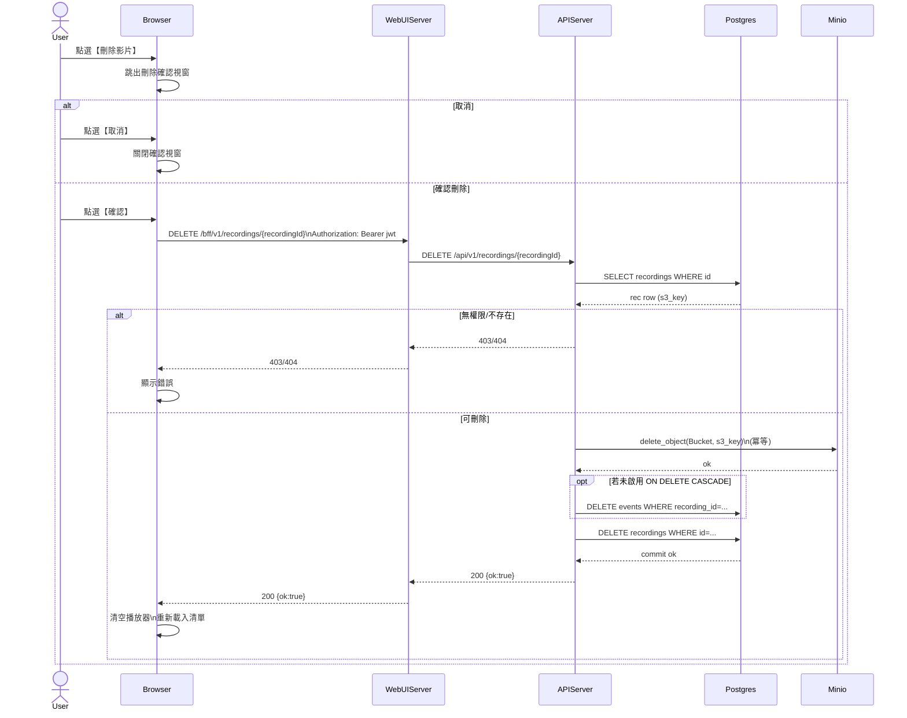

# 2-3-6 刪除錄影

# Mermaid

```mermaid
sequenceDiagram
  actor User
  participant Browser
  participant WebUIServer
  participant APIServer
  participant Postgres
  participant Minio

  User ->> Browser: 點選【刪除影片】
  Browser ->> Browser: 跳出刪除確認視窗

  alt 取消
    User ->> Browser: 點選【取消】
    Browser ->> Browser: 關閉確認視窗
  else 確認刪除
    User ->> Browser: 點選【確認】
    Browser ->> WebUIServer: DELETE /bff/v1/recordings/{recordingId}\nAuthorization: Bearer jwt
    WebUIServer ->> APIServer: DELETE /api/v1/recordings/{recordingId}

    APIServer ->> Postgres: SELECT recordings WHERE id
    Postgres -->> APIServer: rec row (s3_key)

    alt 無權限/不存在
      APIServer -->> WebUIServer: 403/404
      WebUIServer -->> Browser: 403/404
      Browser ->> Browser: 顯示錯誤
    else 可刪除
      APIServer ->> Minio: delete_object(Bucket, s3_key)\n(冪等)
      Minio -->> APIServer: ok

      opt 若未啟用 ON DELETE CASCADE
        APIServer ->> Postgres: DELETE events WHERE recording_id=...
      end
      APIServer ->> Postgres: DELETE recordings WHERE id=...
      Postgres -->> APIServer: commit ok
      APIServer -->> WebUIServer: 200 {ok:true}
      WebUIServer -->> Browser: 200 {ok:true}
      Browser ->> Browser: 清空播放器\n重新載入清單
    end
  end
```

## Mermaid 備註
- 命名對應：功能描述 JSON 中刪除錄影為 `2-3-7`，但你的功能清單要求輸出 `2-3-6`；本檔依清單編號輸出。\n- 後端刪除為硬刪除：刪 S3 物件 + 刪 DB 紀錄（必要時連帶刪 events）。\n+

