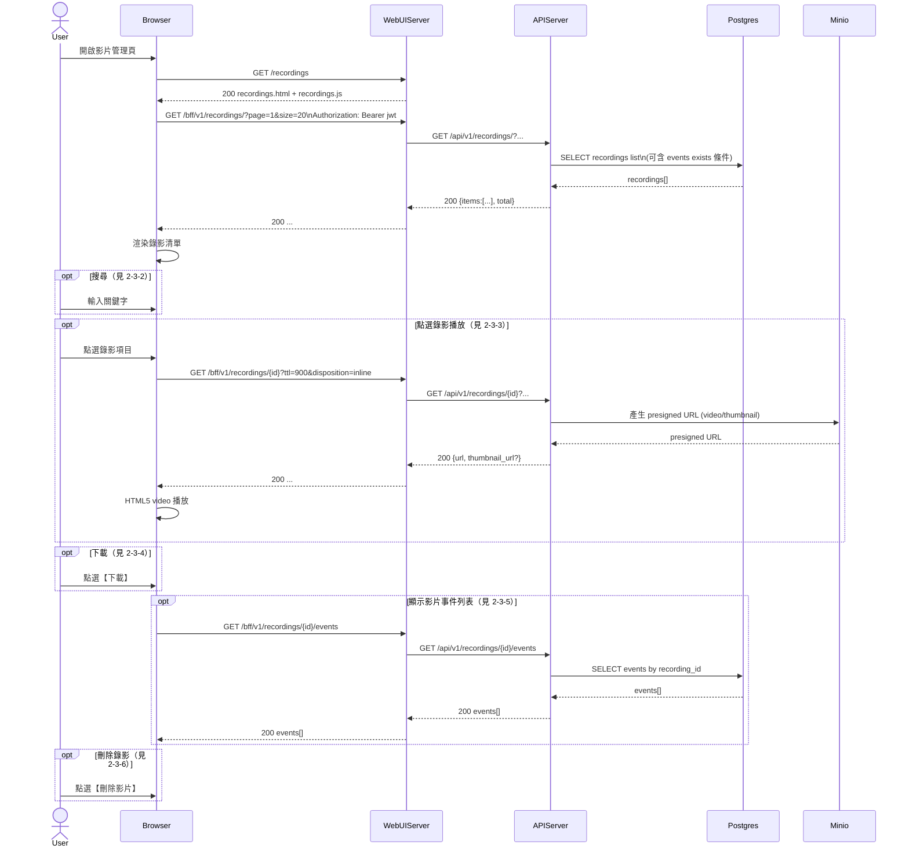

# 2-3 影片管理

# Mermaid

## Mermaid 備註
- 錄影 URL：由 `APIServer /recordings/{id}` 產生 **MinIO presigned GET URL**，支援 `inline/attachment`。\n- 關鍵字搜尋：後端以 `exists` 子查詢在 `events` 上過濾（預設查 `events.summary`）。\n+

