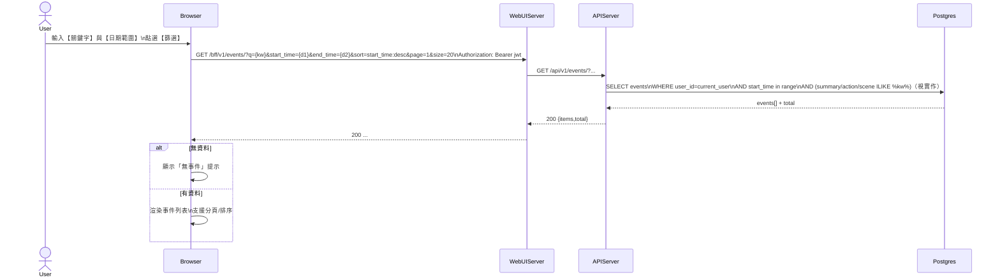

# 2-4-1 事件列表查詢

# Mermaid

## Mermaid 備註
- API：前端使用 `GET /bff/v1/events/`，透過 query string 帶入關鍵字、日期範圍、排序與分頁。\n- 缺少的關鍵資訊：後端 Events router 的 query 參數命名（`q/keywords`）與搜尋欄位範圍需以 `Events/service.py` 為準；本圖以 `q/start_time/end_time/sort` 抽象表示。\n+

