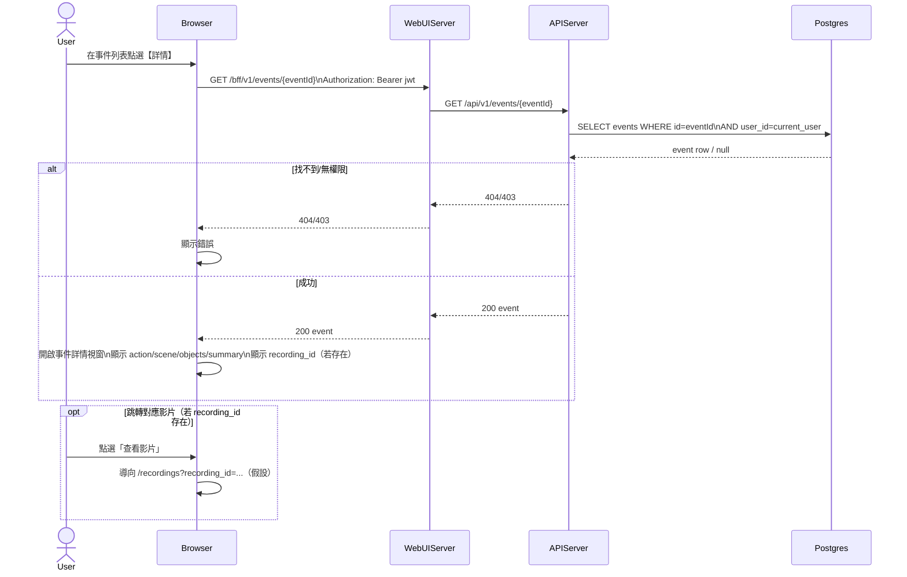

# 2-4-2 檢視單一事件內容

# Mermaid

```mermaid
sequenceDiagram
  actor User
  participant Browser
  participant WebUIServer
  participant APIServer
  participant Postgres

  User ->> Browser: 在事件列表點選【詳情】
  Browser ->> WebUIServer: GET /bff/v1/events/{eventId}\nAuthorization: Bearer jwt
  WebUIServer ->> APIServer: GET /api/v1/events/{eventId}
  APIServer ->> Postgres: SELECT events WHERE id=eventId\nAND user_id=current_user
  Postgres -->> APIServer: event row / null

  alt 找不到/無權限
    APIServer -->> WebUIServer: 404/403
    WebUIServer -->> Browser: 404/403
    Browser ->> Browser: 顯示錯誤
  else 成功
    APIServer -->> WebUIServer: 200 event
    WebUIServer -->> Browser: 200 event
    Browser ->> Browser: 開啟事件詳情視窗\n顯示 action/scene/objects/summary\n顯示 recording_id（若存在）
  end

  opt 跳轉對應影片（若 recording_id 存在）
    User ->> Browser: 點選「查看影片」
    Browser ->> Browser: 導向 /recordings?recording_id=...（假設）
  end
```

## Mermaid 備註
- 單一事件：`GET /events/{id}`。\n- 缺少的關鍵資訊：從事件詳情跳轉到影片管理頁的 URL 參數規格未在描述固定；本圖以假設表示。\n+

