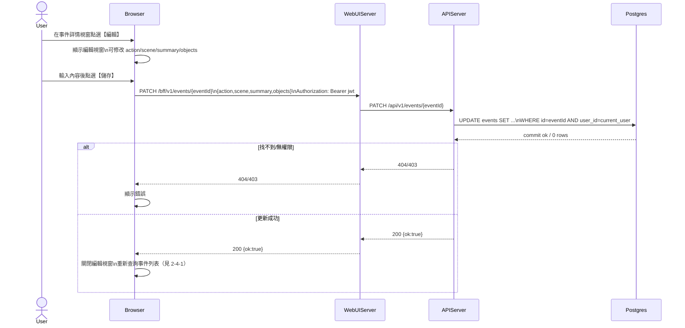

# 2-4-3 編輯事件

# Mermaid

```mermaid
sequenceDiagram
  actor User
  participant Browser
  participant WebUIServer
  participant APIServer
  participant Postgres

  User ->> Browser: 在事件詳情視窗點選【編輯】
  Browser ->> Browser: 顯示編輯視窗\n可修改 action/scene/summary/objects
  User ->> Browser: 輸入內容後點選【儲存】

  Browser ->> WebUIServer: PATCH /bff/v1/events/{eventId}\n{action,scene,summary,objects}\nAuthorization: Bearer jwt
  WebUIServer ->> APIServer: PATCH /api/v1/events/{eventId}
  APIServer ->> Postgres: UPDATE events SET ...\nWHERE id=eventId AND user_id=current_user
  Postgres -->> APIServer: commit ok / 0 rows

  alt 找不到/無權限
    APIServer -->> WebUIServer: 404/403
    WebUIServer -->> Browser: 404/403
    Browser ->> Browser: 顯示錯誤
  else 更新成功
    APIServer -->> WebUIServer: 200 {ok:true}
    WebUIServer -->> Browser: 200 {ok:true}
    Browser ->> Browser: 關閉編輯視窗\n重新查詢事件列表（見 2-4-1）
  end
```

## Mermaid 備註
- 更新事件：`PATCH /events/{id}`。\n- 影響：日記自動刷新可能依 events hash 變化而觸發（見 2-1-2/2-1-3）。\n+

