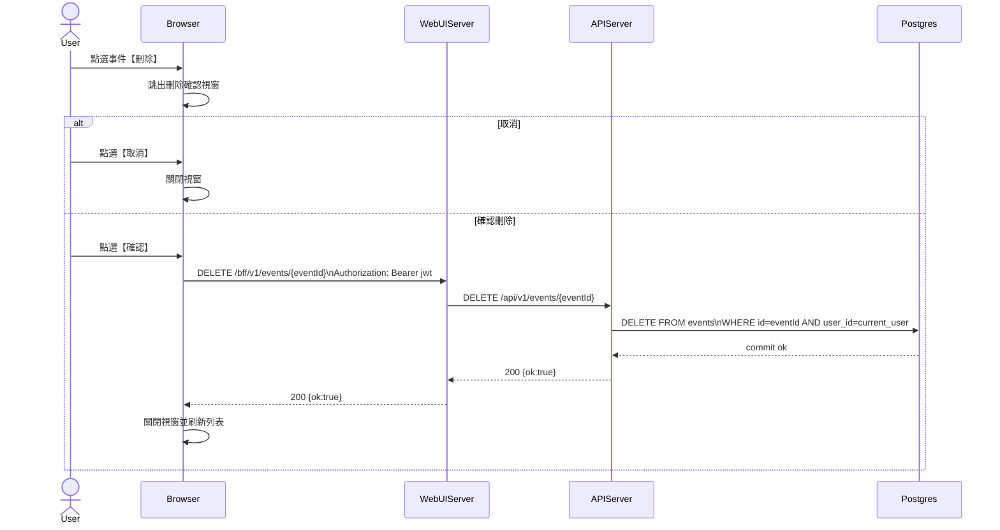

# 2-4-4 刪除事件

# Mermaid

```mermaid
sequenceDiagram
  actor User
  participant Browser
  participant WebUIServer
  participant APIServer
  participant Postgres

  User ->> Browser: 點選事件【刪除】
  Browser ->> Browser: 跳出刪除確認視窗

  alt 取消
    User ->> Browser: 點選【取消】
    Browser ->> Browser: 關閉視窗
  else 確認刪除
    User ->> Browser: 點選【確認】
    Browser ->> WebUIServer: DELETE /bff/v1/events/{eventId}\nAuthorization: Bearer jwt
    WebUIServer ->> APIServer: DELETE /api/v1/events/{eventId}
    APIServer ->> Postgres: DELETE FROM events\nWHERE id=eventId AND user_id=current_user
    Postgres -->> APIServer: commit ok
    APIServer -->> WebUIServer: 200 {ok:true}
    WebUIServer -->> Browser: 200 {ok:true}
    Browser ->> Browser: 關閉視窗並刷新列表
  end
```

## Mermaid 備註
- 刪除事件：`DELETE /events/{id}`。\n- 影響：事件刪除會改變日記自動刷新用的 events hash（見 2-1-2）。\n+

