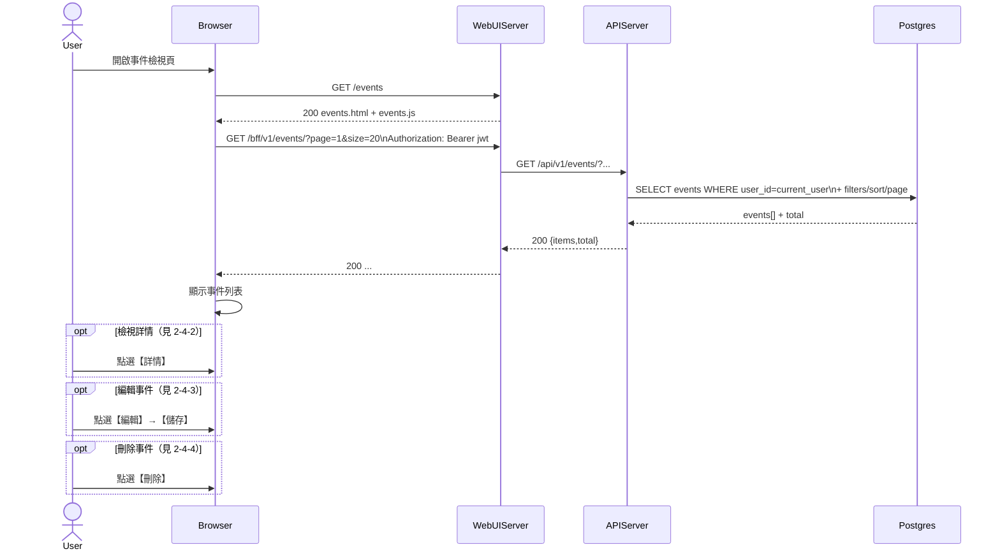

# 2-4 事件檢視（Events）

# Mermaid

```mermaid
sequenceDiagram
  actor User
  participant Browser
  participant WebUIServer
  participant APIServer
  participant Postgres

  User ->> Browser: 開啟事件檢視頁
  Browser ->> WebUIServer: GET /events
  WebUIServer -->> Browser: 200 events.html + events.js

  Browser ->> WebUIServer: GET /bff/v1/events/?page=1&size=20\nAuthorization: Bearer jwt
  WebUIServer ->> APIServer: GET /api/v1/events/?...
  APIServer ->> Postgres: SELECT events WHERE user_id=current_user\n+ filters/sort/page
  Postgres -->> APIServer: events[] + total
  APIServer -->> WebUIServer: 200 {items,total}
  WebUIServer -->> Browser: 200 ...
  Browser ->> Browser: 顯示事件列表

  opt 檢視詳情（見 2-4-2）
    User ->> Browser: 點選【詳情】
  end

  opt 編輯事件（見 2-4-3）
    User ->> Browser: 點選【編輯】→【儲存】
  end

  opt 刪除事件（見 2-4-4）
    User ->> Browser: 點選【刪除】
  end
```

## Mermaid 備註
- API：事件列表/單筆/編輯/刪除對應 `/events`、`/events/{id}`。\n- 權限：後端以 JWT 限制只能查/改/刪自己的 events。\n+

