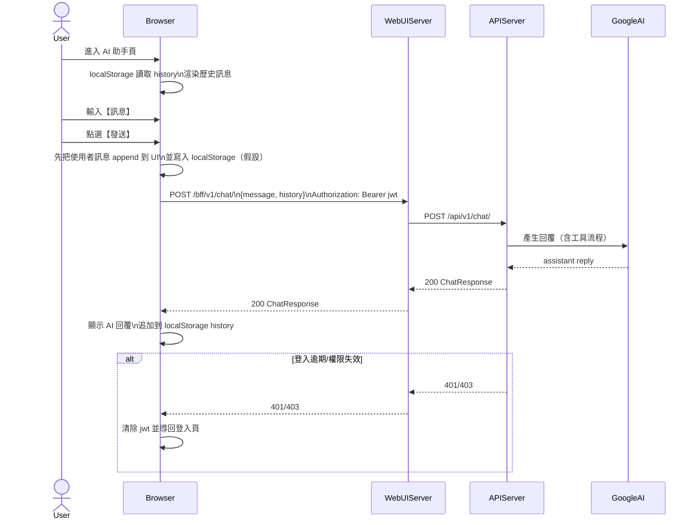

# 2-5-1 送出訊息／顯示對話歷史

# Mermaid

```mermaid
sequenceDiagram
  actor User
  participant Browser
  participant WebUIServer
  participant APIServer
  participant GoogleAI

  User ->> Browser: 進入 AI 助手頁
  Browser ->> Browser: localStorage 讀取 history\n渲染歷史訊息

  User ->> Browser: 輸入【訊息】
  User ->> Browser: 點選【發送】
  Browser ->> Browser: 先把使用者訊息 append 到 UI\n並寫入 localStorage（假設）

  Browser ->> WebUIServer: POST /bff/v1/chat/\n{message, history}\nAuthorization: Bearer jwt
  WebUIServer ->> APIServer: POST /api/v1/chat/
  APIServer ->> GoogleAI: 產生回覆（含工具流程）
  GoogleAI -->> APIServer: assistant reply
  APIServer -->> WebUIServer: 200 ChatResponse
  WebUIServer -->> Browser: 200 ChatResponse

  Browser ->> Browser: 顯示 AI 回覆\n追加到 localStorage history

  alt 登入逾期/權限失效
    APIServer -->> WebUIServer: 401/403
    WebUIServer -->> Browser: 401/403
    Browser ->> Browser: 清除 jwt 並導回登入頁
  end
```

## Mermaid 備註
- 對話歷史：功能描述指定為本機持久化（`localStorage`），後端不保存對話內容。\n- API：`POST /chat/`（BFF 轉發）。\n- 缺少的關鍵資訊：前端是「送出前就寫入 localStorage」或「成功後再寫入」屬 UI 策略；本圖以假設表示。\n+

