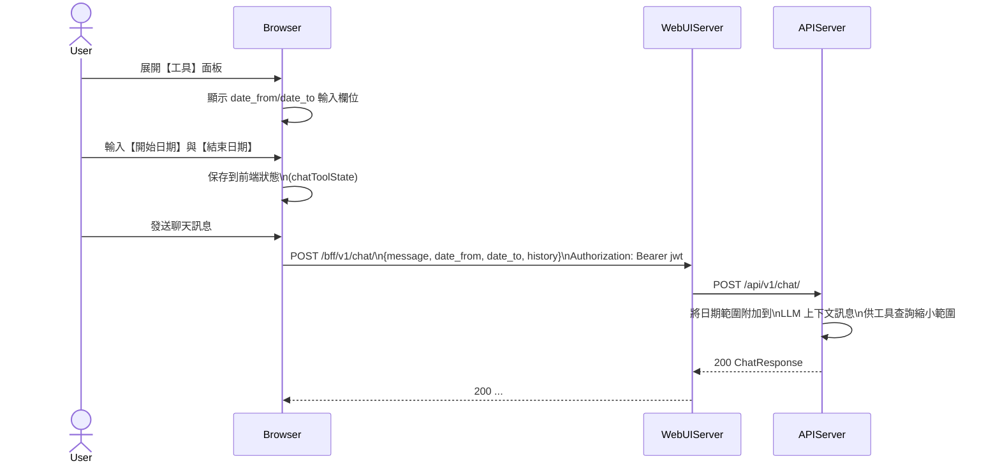

# 2-5-2 指定查詢日期範圍

# Mermaid

```mermaid
sequenceDiagram
  actor User
  participant Browser
  participant WebUIServer
  participant APIServer

  User ->> Browser: 展開【工具】面板
  Browser ->> Browser: 顯示 date_from/date_to 輸入欄位
  User ->> Browser: 輸入【開始日期】與【結束日期】
  Browser ->> Browser: 保存到前端狀態\n(chatToolState)

  User ->> Browser: 發送聊天訊息
  Browser ->> WebUIServer: POST /bff/v1/chat/\n{message, date_from, date_to, history}\nAuthorization: Bearer jwt
  WebUIServer ->> APIServer: POST /api/v1/chat/
  APIServer ->> APIServer: 將日期範圍附加到\nLLM 上下文訊息\n供工具查詢縮小範圍
  APIServer -->> WebUIServer: 200 ChatResponse
  WebUIServer -->> Browser: 200 ...
```

## Mermaid 備註
- 後端會把 `date_from/date_to` 以「上下文」形式附加到最後一條 user message，供 LLM 工具查詢時使用。\n- 缺少的關鍵資訊：前端工具面板的狀態持久化方式（是否存 localStorage）未在描述固定；本圖僅表示存在於前端狀態。\n+

