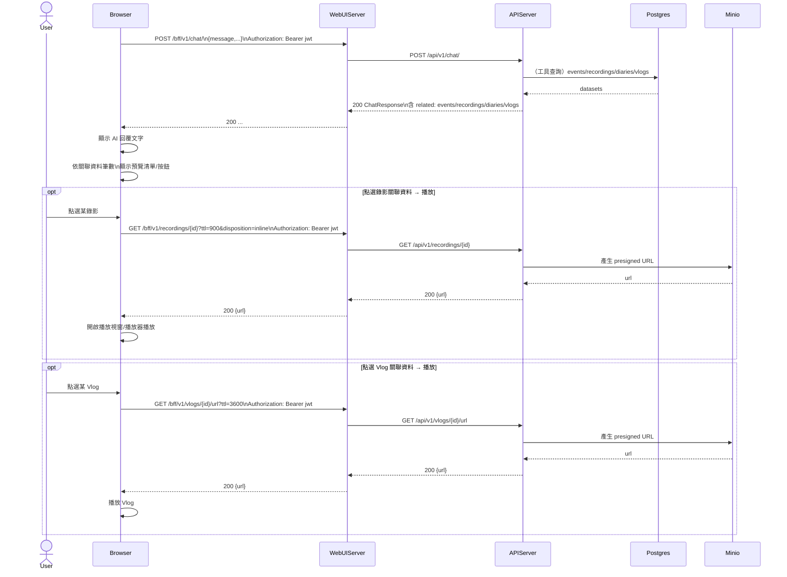

# 2-5-3 顯示回覆與關聯資料

# Mermaid

## Mermaid 備註
- 後端 `ChatResponse` 會帶回「關聯資料」集合，前端依數量呈現預覽與操作入口。\n- 關聯資料的播放實際仍透過既有 API：錄影用 `/recordings/{id}`，Vlog 用 `/vlogs/{id}/url`。\n- 缺少的關鍵資訊：關聯資料 UI 的呈現門檻（多少筆顯示按鈕/清單）屬前端設計，本圖不硬編規則（假設）。\n+

