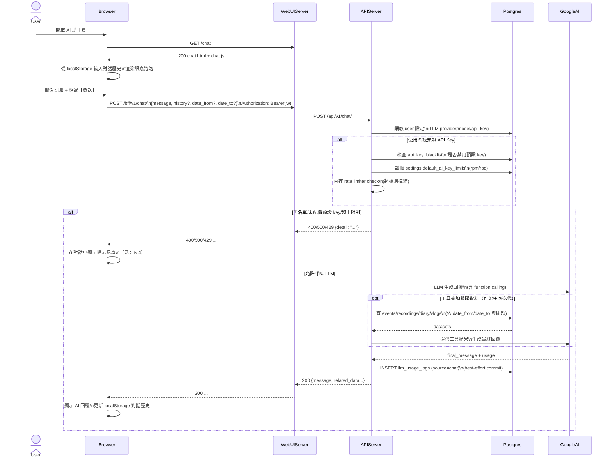

# 2-5 AI 助手

# Mermaid

## Mermaid 備註
- Chat API：`POST /bff/v1/chat/`（可帶 `history`、`date_from/date_to`）。\n- 對話歷史：存於瀏覽器 `localStorage`（非 DB）。\n- 系統預設 key 限制：僅在「未提供個人 key」時套用黑名單與 in-memory rate limiter（`rpm/rpd` 由 settings 決定）。\n+

